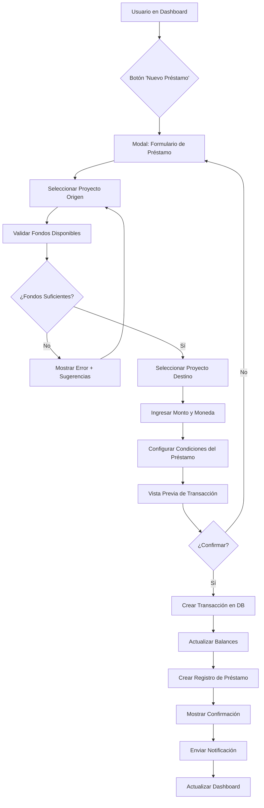
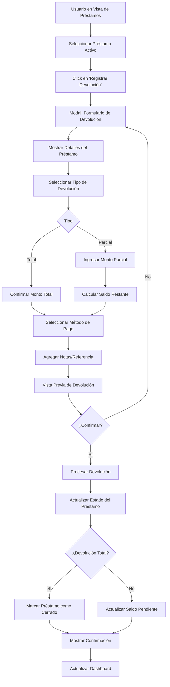
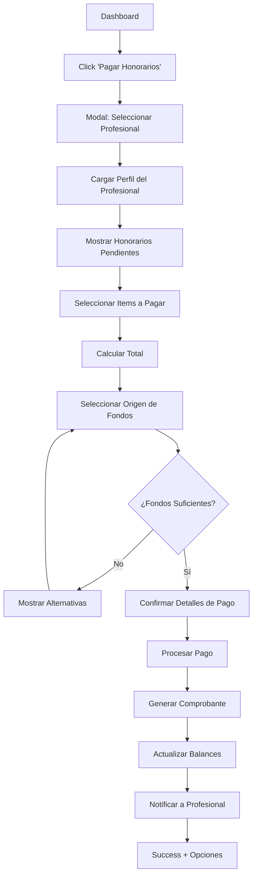
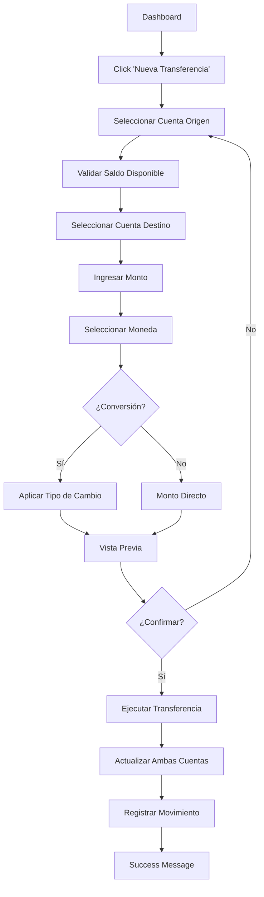

# Sistema de Caja Maestra - Diseño UX y Wireframes

## 📋 Tabla de Contenidos

1. [Arquitectura de Información](#arquitectura-de-información)
2. [User Flows](#user-flows)
3. [Wireframes de Pantallas](#wireframes-de-pantallas)
4. [Estados de Interfaz](#estados-de-interfaz)
5. [Componentes del Design System](#componentes-del-design-system)
6. [Especificaciones de Interacción](#especificaciones-de-interacción)

---

## 1. Arquitectura de Información

### 1.1 Jerarquía de Información

```
📊 Dashboard Principal Caja Maestra
├── 💰 Resumen Financiero Global (Hero Section)
│   ├── Balance Total ARS
│   ├── Balance Total USD
│   ├── Balance Equivalente Total (ARS)
│   └── Último Movimiento
│
├── 📈 Métricas Clave (KPIs Grid)
│   ├── Total Recibido (histórico)
│   ├── Total Prestado (actual)
│   ├── Total Devuelto
│   └── Deuda Pendiente
│
├── ⚠️ Alertas y Acciones Críticas
│   ├── Deudas Vencidas
│   ├── Préstamos por Vencer
│   └── Movimientos Pendientes de Aprobación
│
├── 🔄 Acciones Rápidas (CTAs)
│   ├── Nuevo Préstamo
│   ├── Registrar Devolución
│   ├── Transferencia entre Cuentas
│   └── Pagar Honorarios
│
├── 💳 Préstamos Activos (Tabla Interactiva)
│   ├── Filtros: Estado, Proyecto, Moneda, Fecha
│   ├── Vista de Lista con Detalles
│   └── Acciones por Préstamo
│
└── 📜 Historial de Transacciones (Timeline)
    ├── Filtros Avanzados
    ├── Vista Cronológica
    └── Exportación de Datos
```

### 1.2 Navegación Principal

**Breadcrumb Pattern:**
```
Finanzas > Caja Maestra > [Vista Actual]
```

**Tab Navigation:**
- 📊 **Dashboard** (default)
- 💳 **Préstamos Activos**
- 📜 **Historial Completo**
- ⚙️ **Configuración**

---

## 2. User Flows

### 2.1 Flow: Prestar Dinero de Proyecto A a Proyecto B



**Pasos Detallados:**

1. **Inicio:** Usuario hace click en botón "Nuevo Préstamo" (CTA primario)
2. **Selección de Origen:**
   - Dropdown con proyectos disponibles
   - Muestra balance actual de cada proyecto
   - Indicador visual de fondos disponibles
3. **Validación Automática:**
   - Sistema verifica fondos en tiempo real
   - Mensaje de error claro si no hay fondos
   - Sugerencia: "Proyecto X solo tiene $Y disponible"
4. **Selección de Destino:**
   - Dropdown excluye proyecto origen
   - Muestra necesidad financiera si existe
5. **Configuración de Monto:**
   - Input numérico con validación en tiempo real
   - Selector de moneda (ARS/USD)
   - Mostrar conversión automática si aplica
6. **Condiciones del Préstamo:**
   - Campo de descripción/motivo (obligatorio)
   - Fecha de devolución esperada (opcional)
   - Tasa de interés (opcional, default 0%)
   - Tipo de devolución (total/parcial/cuotas)
7. **Vista Previa:**
   - Resumen visual de la transacción
   - Impacto en balances de ambos proyectos
   - Timeline de devolución si aplica
8. **Confirmación:**
   - Botón de confirmación destacado
   - Checkbox de verificación: "He revisado los datos"
   - Cancelar y volver
9. **Ejecución:**
   - Loading state durante procesamiento
   - Success message con detalles
   - Opción de ver préstamo o crear otro

---

### 2.2 Flow: Registrar Devolución de Préstamo



**Pasos Detallados:**

1. **Selección de Préstamo:**
   - Lista de préstamos activos con estado
   - Badge visual: Pendiente/Parcial/Vencido
   - Click en row o botón "Devolver"
2. **Modal de Devolución:**
   - Header: Detalles del préstamo original
   - Monto prestado, fecha, proyecto origen/destino
   - Deuda actual vs original
3. **Tipo de Devolución:**
   - Radio buttons: Total / Parcial
   - Si parcial: input de monto con validación
   - Mostrar: "Quedarán $X pendientes"
4. **Método de Pago:**
   - Dropdown: Efectivo/Transferencia/Cheque/Tarjeta
   - Campo de referencia/comprobante (opcional)
   - Upload de comprobante (opcional)
5. **Vista Previa:**
   - Tabla comparativa: Antes vs Después
   - Impacto en balances de proyectos
   - Nuevo estado del préstamo
6. **Confirmación y Procesamiento:**
   - Similar a flow anterior
   - Success con opción de imprimir/exportar comprobante

---

### 2.3 Flow: Pagar Honorarios desde Caja Maestra



---

### 2.4 Flow: Transferencia entre Cuentas Bancarias



---

## 3. Wireframes de Pantallas

### 3.1 Dashboard Principal de Caja Maestra

```
┌──────────────────────────────────────────────────────────────────┐
│  Finanzas > Caja Maestra > Dashboard                    [Settings]│
├──────────────────────────────────────────────────────────────────┤
│                                                                   │
│  ┌─────────────────────────────────────────────────────────────┐ │
│  │          💰 RESUMEN FINANCIERO GLOBAL                       │ │
│  │  ┌──────────────┐  ┌──────────────┐  ┌──────────────┐     │ │
│  │  │  Balance ARS │  │  Balance USD │  │   Total ARS   │     │ │
│  │  │  $1,234,567  │  │   $10,500    │  │  $14,500,000  │     │ │
│  │  │  ↑ +15.5%    │  │  ↓ -2.3%     │  │   ↑ +12.1%    │     │ │
│  │  └──────────────┘  └──────────────┘  └──────────────┘     │ │
│  │                                                             │ │
│  │  Último movimiento: Hace 2 horas                     [Ver] │ │
│  └─────────────────────────────────────────────────────────────┘ │
│                                                                   │
│  ┌────────────── MÉTRICAS CLAVE ──────────────────────────────┐ │
│  │  Total Recibido  │  Total Prestado │  Deuda Pendiente │    │ │
│  │   $45,000,000    │   $2,500,000    │    $1,200,000    │    │ │
│  └─────────────────────────────────────────────────────────────┘ │
│                                                                   │
│  ⚠️ ALERTAS ACTIVAS (3)                                           │
│  ┌─────────────────────────────────────────────────────────────┐ │
│  │ 🔴 Préstamo vencido: Proyecto Casa Belgrano - $350,000      │ │
│  │ 🟡 Vence en 3 días: Proyecto Torre Norte - $500,000    [Ver]│ │
│  │ 🟠 Saldo bajo: Proyecto Oficinas Sur - $45,000 disponibles  │ │
│  └─────────────────────────────────────────────────────────────┘ │
│                                                                   │
│  ┌──────────────── ACCIONES RÁPIDAS ────────────────────────┐   │
│  │ [➕ Nuevo Préstamo]  [💸 Registrar Devolución]           │   │
│  │ [🔄 Transferencia]   [💰 Pagar Honorarios]               │   │
│  └──────────────────────────────────────────────────────────┘   │
│                                                                   │
│  ┌─────────────── PRÉSTAMOS ACTIVOS ───────────────────────────┐│
│  │  Filtros: [Estado▼] [Proyecto▼] [Moneda▼] [Fecha▼]   🔍   ││
│  ├──────────────────────────────────────────────────────────────┤│
│  │ Proyecto Origen→Destino │ Monto    │ Vence    │ Estado  │ ││
│  ├──────────────────────────────────────────────────────────────┤│
│  │ Casa Mar del Plata →    │$350,000  │15/03/25 │🔴Vencido│ ││
│  │   Edificio Centro       │   ARS    │-12 días │[Cobrar] │ ││
│  ├──────────────────────────────────────────────────────────────┤│
│  │ Oficinas Norte →        │$500,000  │03/04/25 │🟡Activo │ ││
│  │   Comercio Palermo      │   ARS    │+3 días  │[Devol.] │ ││
│  ├──────────────────────────────────────────────────────────────┤│
│  │ Depto Recoleta →        │$250,000  │20/04/25 │🟢Activo │ ││
│  │   Reforma Belgrano      │   ARS    │+20 días │[Devol.] │ ││
│  └──────────────────────────────────────────────────────────────┘│
│                                          [Ver Todos los Préstamos]│
│                                                                   │
│  ┌──────────── HISTORIAL DE TRANSACCIONES ─────────────────────┐│
│  │  Filtros: [Tipo▼] [Moneda▼] [Rango de Fechas▼]   📊Export ││
│  ├──────────────────────────────────────────────────────────────┤│
│  │ 📅 HOY - 30 Marzo 2025                                      ││
│  │ ┌────────────────────────────────────────────────────────┐ ││
│  │ │ 14:30 │ Préstamo  │ Casa MDP → Edificio Centro         │ ││
│  │ │       │ $350,000  │ Vence: 15/04/25            [Ver]   │ ││
│  │ └────────────────────────────────────────────────────────┘ ││
│  │                                                              ││
│  │ 📅 AYER - 29 Marzo 2025                                     ││
│  │ ┌────────────────────────────────────────────────────────┐ ││
│  │ │ 10:15 │ Devolución│ Oficinas Sur → Caja Maestra        │ ││
│  │ │       │ $200,000  │ Préstamo cerrado           [Ver]   │ ││
│  │ └────────────────────────────────────────────────────────┘ ││
│  └──────────────────────────────────────────────────────────────┘│
│                                                [Cargar Más ▼]    │
└──────────────────────────────────────────────────────────────────┘
```

---

### 3.2 Modal: Nuevo Préstamo

```
┌────────────────────────────────────────────────────────┐
│  ➕ Nuevo Préstamo                            [X]      │
├────────────────────────────────────────────────────────┤
│                                                         │
│  Paso 1 de 3: Origen y Destino                        │
│  ●━━━━━━━━━━━━━━━━ ○━━━━━━━━━━━━━━━━ ○━━━━━━━━━━━━━━│
│                                                         │
│  Proyecto Origen                                       │
│  ┌──────────────────────────────────────────────────┐ │
│  │ 🔍 Seleccionar proyecto...               [▼]     │ │
│  └──────────────────────────────────────────────────┘ │
│                                                         │
│  ┌──────────────────────────────────────────────────┐ │
│  │ 📊 Casa Mar del Plata                            │ │
│  │    Balance disponible: $850,000 ARS              │ │
│  │    Estado: Activo                                │ │
│  └──────────────────────────────────────────────────┘ │
│                                                         │
│  Proyecto Destino                                      │
│  ┌──────────────────────────────────────────────────┐ │
│  │ 🔍 Seleccionar proyecto destino...       [▼]     │ │
│  └──────────────────────────────────────────────────┘ │
│                                                         │
│  ┌──────────────────────────────────────────────────┐ │
│  │ 📊 Edificio Centro                               │ │
│  │    Balance actual: $120,000 ARS                  │ │
│  │    Necesidad financiera: $500,000 ARS            │ │
│  │    Estado: Requiere fondos                       │ │
│  └──────────────────────────────────────────────────┘ │
│                                                         │
│                   [Cancelar]  [Siguiente →]            │
└────────────────────────────────────────────────────────┘

┌────────────────────────────────────────────────────────┐
│  ➕ Nuevo Préstamo                            [X]      │
├────────────────────────────────────────────────────────┤
│                                                         │
│  Paso 2 de 3: Monto y Condiciones                     │
│  ○━━━━━━━━━━━━━━━━ ●━━━━━━━━━━━━━━━━ ○━━━━━━━━━━━━━━│
│                                                         │
│  Monto del Préstamo                                    │
│  ┌─────────────────────┐  ┌────────────┐              │
│  │ $ 350,000           │  │ ARS    [▼] │              │
│  └─────────────────────┘  └────────────┘              │
│  ✓ Fondos disponibles: $850,000 ARS                   │
│                                                         │
│  💱 Equivalente: USD 388 (TC: $902.00)                │
│                                                         │
│  Motivo/Descripción *                                  │
│  ┌──────────────────────────────────────────────────┐ │
│  │ Anticipo para materiales fase construcción       │ │
│  └──────────────────────────────────────────────────┘ │
│                                                         │
│  Condiciones del Préstamo                             │
│  ┌──────────────────────────────────────────────────┐ │
│  │ Fecha de devolución esperada (opcional)          │ │
│  │ ┌─────────────────┐                              │ │
│  │ │ 15/04/2025  📅  │                              │ │
│  │ └─────────────────┘                              │ │
│  │                                                   │ │
│  │ Tipo de devolución                               │ │
│  │ ◉ Pago único  ○ Pagos parciales  ○ Cuotas       │ │
│  │                                                   │ │
│  │ Interés (opcional)                               │ │
│  │ ┌────────┐ % anual                               │ │
│  │ │ 0.00   │ (Sin interés)                         │ │
│  │ └────────┘                                       │ │
│  └──────────────────────────────────────────────────┘ │
│                                                         │
│              [← Atrás]  [Cancelar]  [Siguiente →]     │
└────────────────────────────────────────────────────────┘

┌────────────────────────────────────────────────────────┐
│  ➕ Nuevo Préstamo                            [X]      │
├────────────────────────────────────────────────────────┤
│                                                         │
│  Paso 3 de 3: Confirmar                                │
│  ○━━━━━━━━━━━━━━━━ ○━━━━━━━━━━━━━━━━ ●━━━━━━━━━━━━━━│
│                                                         │
│  📋 RESUMEN DEL PRÉSTAMO                               │
│  ┌──────────────────────────────────────────────────┐ │
│  │  Origen:   Casa Mar del Plata                    │ │
│  │  Destino:  Edificio Centro                       │ │
│  │  Monto:    $350,000 ARS (USD 388)                │ │
│  │  Fecha:    30/03/2025                            │ │
│  │  Vence:    15/04/2025 (16 días)                  │ │
│  │  Interés:  0% (Sin interés)                      │ │
│  │  Motivo:   Anticipo para materiales...           │ │
│  └──────────────────────────────────────────────────┘ │
│                                                         │
│  📊 IMPACTO EN BALANCES                                │
│  ┌──────────────────────────────────────────────────┐ │
│  │  Casa Mar del Plata                              │ │
│  │  Antes:  $850,000  →  Después: $500,000          │ │
│  │                                                   │ │
│  │  Edificio Centro                                 │ │
│  │  Antes:  $120,000  →  Después: $470,000          │ │
│  └──────────────────────────────────────────────────┘ │
│                                                         │
│  ⚠️ IMPORTANTE                                          │
│  Este préstamo se registrará en el historial y        │
│  generará una deuda del proyecto destino hacia el     │
│  proyecto origen. La devolución debe registrarse      │
│  manualmente.                                          │
│                                                         │
│  ☑️ He revisado los datos y confirmo el préstamo      │
│                                                         │
│          [← Atrás]  [Cancelar]  [✓ Confirmar Préstamo]│
└────────────────────────────────────────────────────────┘
```

---

### 3.3 Modal: Registrar Devolución

```
┌────────────────────────────────────────────────────────┐
│  💸 Registrar Devolución de Préstamo          [X]      │
├────────────────────────────────────────────────────────┤
│                                                         │
│  📄 DETALLES DEL PRÉSTAMO                              │
│  ┌──────────────────────────────────────────────────┐ │
│  │  ID: #PREST-2025-003                             │ │
│  │  Origen:   Casa Mar del Plata                    │ │
│  │  Destino:  Edificio Centro                       │ │
│  │  Monto:    $350,000 ARS                          │ │
│  │  Fecha:    30/03/2025                            │ │
│  │  Vence:    15/04/2025                            │ │
│  │  Estado:   🟡 Activo (16 días restantes)         │ │
│  └──────────────────────────────────────────────────┘ │
│                                                         │
│  💰 DEUDA ACTUAL                                       │
│  ┌──────────────────────────────────────────────────┐ │
│  │  Monto original:     $350,000                    │ │
│  │  Devuelto hasta hoy: $      0                    │ │
│  │  ─────────────────────────────────               │ │
│  │  SALDO PENDIENTE:    $350,000                    │ │
│  └──────────────────────────────────────────────────┘ │
│                                                         │
│  Tipo de Devolución                                    │
│  ┌──────────────────────────────────────────────────┐ │
│  │  ◉ Devolución Total ($350,000)                   │ │
│  │  ○ Devolución Parcial                            │ │
│  │     └─ Monto: $ [___________]                    │ │
│  └──────────────────────────────────────────────────┘ │
│                                                         │
│  Método de Pago                                        │
│  ┌──────────────────────────────────────────────────┐ │
│  │  Transferencia                              [▼]  │ │
│  └──────────────────────────────────────────────────┘ │
│                                                         │
│  Referencia/Comprobante (opcional)                     │
│  ┌──────────────────────────────────────────────────┐ │
│  │  TRANS-20250330-1234                             │ │
│  └──────────────────────────────────────────────────┘ │
│                                                         │
│  📎 Adjuntar comprobante (opcional)                    │
│  ┌──────────────────────────────────────────────────┐ │
│  │  [📄 Seleccionar archivo...]                     │ │
│  └──────────────────────────────────────────────────┘ │
│                                                         │
│  Notas                                                 │
│  ┌──────────────────────────────────────────────────┐ │
│  │  Devolución completa según lo acordado           │ │
│  └──────────────────────────────────────────────────┘ │
│                                                         │
│  📊 IMPACTO                                            │
│  ┌──────────────────────────────────────────────────┐ │
│  │  Estado del préstamo: Activo → ✓ Cerrado        │ │
│  │                                                   │ │
│  │  Casa Mar del Plata (recibe)                     │ │
│  │  Balance: $500,000 → $850,000 (+$350,000)       │ │
│  │                                                   │ │
│  │  Edificio Centro (devuelve)                      │ │
│  │  Balance: $470,000 → $120,000 (-$350,000)       │ │
│  └──────────────────────────────────────────────────┘ │
│                                                         │
│            [Cancelar]  [✓ Registrar Devolución]       │
└────────────────────────────────────────────────────────┘
```

---

### 3.4 Vista de Detalles de Préstamo

```
┌──────────────────────────────────────────────────────────────────┐
│  ← Volver a Préstamos                                            │
├──────────────────────────────────────────────────────────────────┤
│                                                                   │
│  📄 PRÉSTAMO #PREST-2025-003                                     │
│  ┌─────────────────────────────────────────────────────────────┐ │
│  │  Estado: 🟡 Activo  │  Creado: 30/03/2025  │  Vence: 15/04/25│ │
│  └─────────────────────────────────────────────────────────────┘ │
│                                                                   │
│  ┌──────────────────── INFORMACIÓN GENERAL ────────────────────┐ │
│  │                                                              │ │
│  │  Proyecto Origen                                            │ │
│  │  🏗️ Casa Mar del Plata                                      │ │
│  │  Código: PRJ-2025-001                                       │ │
│  │  Balance actual: $500,000 ARS                               │ │
│  │                                                              │ │
│  │         ↓ $350,000 ARS                                      │ │
│  │                                                              │ │
│  │  Proyecto Destino                                           │ │
│  │  🏢 Edificio Centro                                         │ │
│  │  Código: PRJ-2025-005                                       │ │
│  │  Balance actual: $470,000 ARS                               │ │
│  │                                                              │ │
│  └──────────────────────────────────────────────────────────────┘ │
│                                                                   │
│  ┌───────────────────── DETALLES FINANCIEROS ──────────────────┐ │
│  │  Monto Original:     $350,000 ARS                           │ │
│  │  Equivalente USD:    USD 388 (TC: $902.00)                  │ │
│  │  Devuelto:           $0 (0%)                                │ │
│  │  Saldo Pendiente:    $350,000 (100%)                        │ │
│  │  Interés:            0% anual                               │ │
│  │  Tipo:               Pago único                             │ │
│  └──────────────────────────────────────────────────────────────┘ │
│                                                                   │
│  ┌──────────────────────── TIMELINE ──────────────────────────┐ │
│  │                                                              │ │
│  │  ●━━━━━━━━━━━━━━━━━━━━━━━━○━━━━━━━━━━━━━━━━━━○             │ │
│  │  30/03                   HOY                15/04           │ │
│  │  Creado              (Día 1 de 16)        Vence            │ │
│  │                                                              │ │
│  │  Tiempo transcurrido: █████░░░░░░░░░░░ 1 de 16 días        │ │
│  │                                                              │ │
│  └──────────────────────────────────────────────────────────────┘ │
│                                                                   │
│  ┌────────────────────── HISTORIAL ───────────────────────────┐ │
│  │                                                              │ │
│  │  📅 30/03/2025 14:30                                        │ │
│  │  ✓ Préstamo creado                                          │ │
│  │  Usuario: Federico Carrizo                                  │ │
│  │  Motivo: Anticipo para materiales fase construcción        │ │
│  │  ────────────────────────────────────────────────────────── │ │
│  │                                                              │ │
│  │  (No hay devoluciones registradas)                          │ │
│  │                                                              │ │
│  └──────────────────────────────────────────────────────────────┘ │
│                                                                   │
│  ┌──────────────────────── ACCIONES ──────────────────────────┐ │
│  │  [💸 Registrar Devolución]  [✏️ Editar]  [❌ Cancelar]     │ │
│  │  [📊 Exportar PDF]  [📤 Compartir]                          │ │
│  └──────────────────────────────────────────────────────────────┘ │
│                                                                   │
└──────────────────────────────────────────────────────────────────┘
```

---

### 3.5 Tabla de Historial de Transacciones

```
┌──────────────────────────────────────────────────────────────────┐
│  📜 Historial de Transacciones                                   │
├──────────────────────────────────────────────────────────────────┤
│                                                                   │
│  ┌──────────────── FILTROS AVANZADOS ─────────────────────────┐ │
│  │  Tipo de Movimiento                                         │ │
│  │  ☑️ Préstamos  ☑️ Devoluciones  ☑️ Transferencias          │ │
│  │  ☑️ Honorarios  ☑️ Ajustes                                 │ │
│  │                                                              │ │
│  │  Moneda: [Todas▼]  Rango: [Último mes▼]  [Desde▼] [Hasta▼]│ │
│  │                                                              │ │
│  │  Proyecto: [Todos los proyectos▼]                           │ │
│  │                                                              │ │
│  │  [🔍 Buscar por descripción...]              [Limpiar]     │ │
│  └──────────────────────────────────────────────────────────────┘ │
│                                                                   │
│  [Exportar Excel] [Exportar PDF] [Imprimir]                     │
│                                                                   │
│  ┌──────────────────────────────────────────────────────────────┐│
│  │  Mostrando 45 transacciones - Total: $12,350,000 ARS       ││
│  ├──────────────────────────────────────────────────────────────┤│
│  │                                                              ││
│  │  📅 HOY - 30 Marzo 2025                                     ││
│  │  ┌────────────────────────────────────────────────────────┐││
│  │  │ 14:30  │ 💰 Préstamo                                   │││
│  │  │        │ Casa Mar del Plata → Edificio Centro          │││
│  │  │        │ $350,000 ARS                                  │││
│  │  │        │ Motivo: Anticipo materiales                   │││
│  │  │        │ Estado: Activo · Vence 15/04/25      [Ver]    │││
│  │  └────────────────────────────────────────────────────────┘││
│  │                                                              ││
│  │  ┌────────────────────────────────────────────────────────┐││
│  │  │ 09:15  │ 🔄 Transferencia                              │││
│  │  │        │ Cuenta HSBC ARS → Cuenta Santander ARS       │││
│  │  │        │ $500,000 ARS                                  │││
│  │  │        │ Referencia: TRANS-20250330-0915               │││
│  │  │        │ Estado: Completada                   [Ver]    │││
│  │  └────────────────────────────────────────────────────────┘││
│  │                                                              ││
│  │  📅 AYER - 29 Marzo 2025                                    ││
│  │  ┌────────────────────────────────────────────────────────┐││
│  │  │ 16:45  │ 💸 Devolución                                 │││
│  │  │        │ Oficinas Norte → Caja Maestra                 │││
│  │  │        │ $200,000 ARS (Total)                          │││
│  │  │        │ Préstamo: #PREST-2025-001                     │││
│  │  │        │ Estado: ✓ Préstamo cerrado           [Ver]    │││
│  │  └────────────────────────────────────────────────────────┘││
│  │                                                              ││
│  │  ┌────────────────────────────────────────────────────────┐││
│  │  │ 11:20  │ 💰 Pago Honorarios                            │││
│  │  │        │ Caja Maestra → Arq. García                    │││
│  │  │        │ $150,000 ARS                                  │││
│  │  │        │ Concepto: Honorarios marzo 2025               │││
│  │  │        │ Estado: Pagado                       [Ver]    │││
│  │  └────────────────────────────────────────────────────────┘││
│  │                                                              ││
│  │  📅 28 Marzo 2025                                           ││
│  │  ┌────────────────────────────────────────────────────────┐││
│  │  │ 14:00  │ 💰 Préstamo                                   │││
│  │  │        │ Depto Recoleta → Reforma Belgrano             │││
│  │  │        │ $250,000 ARS                                  │││
│  │  │        │ Estado: Activo · Vence 20/04/25      [Ver]    │││
│  │  └────────────────────────────────────────────────────────┘││
│  │                                                              ││
│  └──────────────────────────────────────────────────────────────┘│
│                                          [Cargar Más ▼]          │
│                                                                   │
└──────────────────────────────────────────────────────────────────┘
```

---

## 4. Estados de Interfaz

### 4.1 Estado Vacío (Sin Transacciones)

```
┌──────────────────────────────────────────────────────────────────┐
│  📊 Dashboard de Caja Maestra                                    │
├──────────────────────────────────────────────────────────────────┤
│                                                                   │
│           ╔═══════════════════════════════════════╗              │
│           ║                                       ║              │
│           ║         📭                            ║              │
│           ║                                       ║              │
│           ║    No hay transacciones todavía      ║              │
│           ║                                       ║              │
│           ║    La Caja Maestra está lista para   ║              │
│           ║    gestionar tus flujos financieros. ║              │
│           ║                                       ║              │
│           ║    [➕ Crear Primera Transacción]     ║              │
│           ║                                       ║              │
│           ║    ¿Necesitas ayuda?                 ║              │
│           ║    📚 [Ver Guía de Inicio]           ║              │
│           ║                                       ║              │
│           ╚═══════════════════════════════════════╝              │
│                                                                   │
└──────────────────────────────────────────────────────────────────┘
```

### 4.2 Estado con Deudas Vencidas (Alertas Críticas)

```
┌──────────────────────────────────────────────────────────────────┐
│  ⚠️ ALERTAS CRÍTICAS (5)                         [Ver todas]     │
├──────────────────────────────────────────────────────────────────┤
│                                                                   │
│  🔴 DEUDAS VENCIDAS (2)                                          │
│  ┌─────────────────────────────────────────────────────────────┐ │
│  │  Préstamo vencido hace 12 días                              │ │
│  │  Casa Mar del Plata → Edificio Centro                       │ │
│  │  $350,000 ARS                                               │ │
│  │  [💸 Registrar Devolución]  [📞 Contactar]  [⏰ Extender]  │ │
│  └─────────────────────────────────────────────────────────────┘ │
│                                                                   │
│  ┌─────────────────────────────────────────────────────────────┐ │
│  │  Préstamo vencido hace 5 días                               │ │
│  │  Oficinas Norte → Comercio Palermo                          │ │
│  │  $180,000 ARS                                               │ │
│  │  [💸 Registrar Devolución]  [📞 Contactar]  [⏰ Extender]  │ │
│  └─────────────────────────────────────────────────────────────┘ │
│                                                                   │
│  🟡 POR VENCER (3 días o menos)                                 │
│  ┌─────────────────────────────────────────────────────────────┐ │
│  │  Vence en 3 días: Torre Norte - $500,000          [Ver]    │ │
│  │  Vence mañana: Reforma Sur - $220,000             [Ver]    │ │
│  └─────────────────────────────────────────────────────────────┘ │
│                                                                   │
│  🟠 SALDOS BAJOS (1)                                             │
│  ┌─────────────────────────────────────────────────────────────┐ │
│  │  Oficinas Sur - Solo $45,000 disponibles          [Ver]    │ │
│  └─────────────────────────────────────────────────────────────┘ │
│                                                                   │
└──────────────────────────────────────────────────────────────────┘
```

### 4.3 Estado de Carga

```
┌──────────────────────────────────────────────────────────────────┐
│  📊 Dashboard de Caja Maestra                                    │
├──────────────────────────────────────────────────────────────────┤
│                                                                   │
│  ┌─────────────────────────────────────────────────────────────┐ │
│  │          💰 RESUMEN FINANCIERO GLOBAL                       │ │
│  │  ┌──────────────┐  ┌──────────────┐  ┌──────────────┐     │ │
│  │  │  ⏳ Cargando │  │  ⏳ Cargando │  │  ⏳ Cargando  │     │ │
│  │  │      ...     │  │      ...     │  │      ...      │     │ │
│  │  └──────────────┘  └──────────────┘  └──────────────┘     │ │
│  └─────────────────────────────────────────────────────────────┘ │
│                                                                   │
│  ┌─────────────────────────────────────────────────────────────┐ │
│  │  ⏳ Cargando préstamos activos...                           │ │
│  │     ████████░░░░░░░░░░░░░░░░░░ 42%                          │ │
│  └─────────────────────────────────────────────────────────────┘ │
│                                                                   │
└──────────────────────────────────────────────────────────────────┘
```

### 4.4 Estados de Error

```
┌────────────────────────────────────────────────────────┐
│  ❌ Error al Procesar Préstamo                [X]      │
├────────────────────────────────────────────────────────┤
│                                                         │
│  ⚠️ No se pudo completar la operación                  │
│                                                         │
│  Problema:                                             │
│  Fondos insuficientes en el proyecto origen.           │
│                                                         │
│  Detalles:                                             │
│  • Solicitado: $350,000 ARS                           │
│  • Disponible: $280,000 ARS                           │
│  • Faltante: $70,000 ARS                              │
│                                                         │
│  Sugerencias:                                          │
│  □ Reducir el monto del préstamo                      │
│  □ Transferir fondos al proyecto origen               │
│  □ Usar fondos de otro proyecto                       │
│                                                         │
│  [Ajustar Monto]  [Transferir Fondos]  [Cancelar]    │
│                                                         │
└────────────────────────────────────────────────────────┘

┌────────────────────────────────────────────────────────┐
│  ⚠️ Validación de Datos                       [X]      │
├────────────────────────────────────────────────────────┤
│                                                         │
│  Por favor corrige los siguientes campos:             │
│                                                         │
│  • Proyecto Destino: Campo requerido                  │
│  • Monto: Debe ser mayor a $0                         │
│  • Descripción: Mínimo 10 caracteres                  │
│                                                         │
│                              [Entendido]               │
│                                                         │
└────────────────────────────────────────────────────────┘

┌────────────────────────────────────────────────────────┐
│  🔴 Error de Conexión                         [X]      │
├────────────────────────────────────────────────────────┤
│                                                         │
│  No pudimos conectar con el servidor.                 │
│                                                         │
│  Por favor:                                            │
│  1. Verifica tu conexión a internet                   │
│  2. Intenta nuevamente                                │
│  3. Si persiste, contacta a soporte                   │
│                                                         │
│  [🔄 Reintentar]  [📞 Contactar Soporte]              │
│                                                         │
└────────────────────────────────────────────────────────┘
```

---

## 5. Componentes del Design System

### 5.1 Mapeo de Componentes Existentes

Basado en la estructura del proyecto `/src/design-system/`, estos son los componentes a utilizar:

#### **5.1.1 Layout Components**

```typescript
// PageHeader - Para encabezados de sección
<PageHeader
  title="Caja Maestra"
  description="Gestión centralizada de flujos financieros entre proyectos"
  actions={
    <Button onClick={handleNewLoan}>
      ➕ Nuevo Préstamo
    </Button>
  }
/>

// Grid System - Para layouts responsive
<Grid cols={3} gap="lg">
  <MetricCard {...arsBalance} />
  <MetricCard {...usdBalance} />
  <MetricCard {...totalBalance} />
</Grid>
```

#### **5.1.2 Data Display Components**

```typescript
// MetricGrid - Para KPIs principales
<MetricGrid
  metrics={[
    {
      label: "Balance ARS",
      value: formatCurrency(1234567, 'ARS'),
      trend: { value: 15.5, direction: "up" },
      icon: "💰"
    },
    {
      label: "Balance USD",
      value: formatCurrency(10500, 'USD'),
      trend: { value: -2.3, direction: "down" },
      icon: "💵"
    },
    // ...más métricas
  ]}
/>

// DataTable - Para tabla de préstamos
<DataTable
  columns={[
    { key: 'origin', header: 'Proyecto Origen', sortable: true },
    { key: 'destination', header: 'Proyecto Destino', sortable: true },
    { key: 'amount', header: 'Monto', sortable: true, format: 'currency' },
    { key: 'dueDate', header: 'Vence', sortable: true, format: 'date' },
    { key: 'status', header: 'Estado', render: (row) => <StatusBadge status={row.status} /> },
    { key: 'actions', header: '', render: (row) => <ActionButtons loan={row} /> }
  ]}
  data={activeLoans}
  searchable
  filterable
  exportable
/>

// CardSkeleton - Para estados de carga
<CardSkeleton
  count={3}
  height="120px"
  showAvatar={false}
/>
```

#### **5.1.3 Form Components**

```typescript
// UI Components - Formularios
import {
  Button,
  Input,
  Select,
  Textarea,
  Checkbox,
  Radio,
  DatePicker,
  FileUpload
} from '@/components/ui'

// Ejemplo de formulario de préstamo
<form onSubmit={handleSubmit}>
  <Select
    label="Proyecto Origen"
    placeholder="Seleccionar proyecto..."
    options={projectOptions}
    value={selectedOrigin}
    onChange={setSelectedOrigin}
    required
    helperText="Balance disponible: $850,000 ARS"
  />

  <Input
    type="number"
    label="Monto del Préstamo"
    value={amount}
    onChange={setAmount}
    prefix="$"
    suffix="ARS"
    required
    error={amountError}
  />

  <DatePicker
    label="Fecha de devolución esperada"
    value={dueDate}
    onChange={setDueDate}
    minDate={new Date()}
  />

  <Textarea
    label="Motivo/Descripción"
    value={description}
    onChange={setDescription}
    rows={3}
    maxLength={500}
    required
  />

  <Button type="submit" variant="primary" fullWidth>
    Confirmar Préstamo
  </Button>
</form>
```

#### **5.1.4 Feedback Components**

```typescript
// Badge - Para estados visuales
<Badge
  variant={loan.status === 'overdue' ? 'danger' : loan.status === 'active' ? 'warning' : 'success'}
  icon={getStatusIcon(loan.status)}
>
  {getStatusLabel(loan.status)}
</Badge>

// Alert - Para notificaciones y alertas
<Alert variant="danger" icon="🔴" dismissible>
  <AlertTitle>Préstamo vencido</AlertTitle>
  <AlertDescription>
    Casa Mar del Plata → Edificio Centro: $350,000 ARS
  </AlertDescription>
  <AlertActions>
    <Button size="sm" onClick={handleRegisterPayment}>
      Registrar Devolución
    </Button>
  </AlertActions>
</Alert>

// Toast - Para confirmaciones rápidas
import { toast } from '@/components/ui/toast'

toast.success('Préstamo registrado exitosamente', {
  description: '$350,000 ARS de Casa MDP a Edificio Centro',
  action: {
    label: 'Ver préstamo',
    onClick: () => router.push(`/loans/${loanId}`)
  }
})

// ErrorBoundary - Para manejo de errores
<ErrorBoundary fallback={<ErrorFallback />}>
  <MasterCashDashboard />
</ErrorBoundary>
```

#### **5.1.5 Overlay Components**

```typescript
// Modal - Para formularios complejos
<Modal
  isOpen={isLoanModalOpen}
  onClose={closeLoanModal}
  title="Nuevo Préstamo"
  size="lg"
  closeOnOverlayClick={false}
>
  <ModalContent>
    <LoanForm onSubmit={handleLoanSubmit} />
  </ModalContent>
  <ModalFooter>
    <Button variant="ghost" onClick={closeLoanModal}>
      Cancelar
    </Button>
    <Button variant="primary" onClick={submitLoan}>
      Confirmar Préstamo
    </Button>
  </ModalFooter>
</Modal>

// Drawer - Para paneles laterales
<Drawer
  isOpen={isFilterDrawerOpen}
  onClose={closeFilterDrawer}
  position="right"
  title="Filtros Avanzados"
>
  <FilterForm filters={filters} onChange={setFilters} />
</Drawer>

// Tooltip - Para ayuda contextual
<Tooltip content="Este préstamo está vencido hace 12 días">
  <Badge variant="danger">Vencido</Badge>
</Tooltip>
```

#### **5.1.6 Navigation Components**

```typescript
// Breadcrumb
<Breadcrumb>
  <BreadcrumbItem href="/finance">Finanzas</BreadcrumbItem>
  <BreadcrumbItem href="/finance/master-cash">Caja Maestra</BreadcrumbItem>
  <BreadcrumbItem current>Dashboard</BreadcrumbItem>
</Breadcrumb>

// Tabs
<Tabs defaultValue="dashboard">
  <TabsList>
    <TabsTrigger value="dashboard">📊 Dashboard</TabsTrigger>
    <TabsTrigger value="loans">💳 Préstamos Activos</TabsTrigger>
    <TabsTrigger value="history">📜 Historial</TabsTrigger>
    <TabsTrigger value="settings">⚙️ Configuración</TabsTrigger>
  </TabsList>

  <TabsContent value="dashboard">
    <DashboardView />
  </TabsContent>

  <TabsContent value="loans">
    <ActiveLoansView />
  </TabsContent>

  {/* ... más contenido */}
</Tabs>
```

---

### 5.2 Componentes Custom a Crear

#### **LoanCard** - Tarjeta de préstamo resumida
```typescript
interface LoanCardProps {
  loan: Loan
  onRegisterPayment: () => void
  onViewDetails: () => void
}

// Uso:
<LoanCard
  loan={loan}
  onRegisterPayment={() => openPaymentModal(loan.id)}
  onViewDetails={() => router.push(`/loans/${loan.id}`)}
/>
```

#### **TransactionTimeline** - Timeline de transacciones
```typescript
interface TransactionTimelineProps {
  transactions: Transaction[]
  groupBy?: 'date' | 'project' | 'type'
  showFilters?: boolean
}

// Uso:
<TransactionTimeline
  transactions={transactions}
  groupBy="date"
  showFilters
/>
```

#### **BalanceChart** - Gráfico de evolución de balances
```typescript
interface BalanceChartProps {
  data: BalanceData[]
  currency: 'ARS' | 'USD' | 'both'
  period: 'week' | 'month' | 'quarter' | 'year'
}

// Uso:
<BalanceChart
  data={balanceHistory}
  currency="both"
  period="month"
/>
```

#### **CurrencyConverter** - Conversor de monedas inline
```typescript
interface CurrencyConverterProps {
  amount: number
  fromCurrency: Currency
  toCurrency: Currency
  exchangeRate: number
  showIcon?: boolean
}

// Uso:
<CurrencyConverter
  amount={350000}
  fromCurrency="ARS"
  toCurrency="USD"
  exchangeRate={902}
  showIcon
/>
// Muestra: "ARS $350,000 ≈ USD $388"
```

---

## 6. Especificaciones de Interacción

### 6.1 Responsive Breakpoints

```css
/* Basado en Tailwind CSS v4 */
--breakpoint-sm: 640px;   /* Mobile landscape */
--breakpoint-md: 768px;   /* Tablet */
--breakpoint-lg: 1024px;  /* Desktop */
--breakpoint-xl: 1280px;  /* Large desktop */
--breakpoint-2xl: 1536px; /* Extra large */
```

**Layout Adaptativo:**

- **Mobile (< 640px):**
  - Stack vertical de todas las secciones
  - CTAs full-width
  - Tabla → Cards colapsables
  - Modal full-screen

- **Tablet (640px - 1024px):**
  - Grid de 2 columnas para métricas
  - Tabla con scroll horizontal
  - Modal centered (80% width)

- **Desktop (> 1024px):**
  - Grid de 3-4 columnas
  - Vista completa de tabla
  - Modal centered (600px max-width)

### 6.2 Animaciones y Transiciones

```css
/* Tokens de animación */
--transition-fast: 150ms ease-in-out;
--transition-base: 200ms ease-in-out;
--transition-slow: 300ms ease-in-out;

/* Ejemplos de uso */
.button {
  transition: all var(--transition-fast);
}

.modal-overlay {
  animation: fadeIn var(--transition-base);
}

.loan-card:hover {
  transform: translateY(-2px);
  transition: transform var(--transition-base);
}
```

**Animaciones clave:**
- **Fade In:** Entrada de modales y overlays
- **Slide Up:** Toasts y notificaciones
- **Scale:** Hover en cards interactivos
- **Skeleton Pulse:** Loading states

### 6.3 Accesibilidad (A11y)

**Requisitos WCAG 2.1 AA:**

1. **Contraste de Color:**
   - Ratio mínimo 4.5:1 para texto normal
   - Ratio mínimo 3:1 para texto grande y elementos interactivos

2. **Navegación por Teclado:**
   ```typescript
   // Todos los elementos interactivos accesibles por Tab
   <Button
     onClick={handleClick}
     onKeyDown={(e) => e.key === 'Enter' && handleClick()}
     tabIndex={0}
   >
     Acción
   </Button>
   ```

3. **Screen Readers:**
   ```typescript
   // ARIA labels descriptivos
   <Button aria-label="Crear nuevo préstamo entre proyectos">
     ➕ Nuevo Préstamo
   </Button>

   <Table aria-label="Lista de préstamos activos">
     {/* ... */}
   </Table>
   ```

4. **Estados de Enfoque:**
   ```css
   .button:focus-visible {
     outline: 2px solid var(--color-primary);
     outline-offset: 2px;
   }
   ```

5. **Mensajes de Error:**
   - Asociar labels con inputs usando `htmlFor`
   - Mostrar errores con `role="alert"`
   - Validación inline con feedback inmediato

### 6.4 Estados de Carga y Feedback

**Skeleton Screens:**
```typescript
// Durante carga inicial
{isLoading ? (
  <CardSkeleton count={3} />
) : (
  <MetricGrid metrics={metrics} />
)}
```

**Loading Indicators:**
```typescript
// Durante acciones asíncronas
<Button
  onClick={handleSubmit}
  isLoading={isSubmitting}
  loadingText="Procesando..."
>
  Confirmar Préstamo
</Button>
```

**Optimistic Updates:**
```typescript
// Actualizar UI antes de confirmación del servidor
const handleRegisterPayment = async (loanId, amount) => {
  // 1. Actualizar estado local inmediatamente
  updateLoanLocally(loanId, { status: 'processing' })

  try {
    // 2. Llamar a API
    await registerPayment(loanId, amount)

    // 3. Confirmar con servidor
    toast.success('Devolución registrada')
  } catch (error) {
    // 4. Revertir en caso de error
    revertLoanUpdate(loanId)
    toast.error('Error al procesar devolución')
  }
}
```

### 6.5 Validaciones y Reglas de Negocio

**Validaciones de Formulario:**

1. **Monto del Préstamo:**
   - Debe ser > 0
   - No puede exceder balance disponible del proyecto origen
   - Validación en tiempo real mientras escribe

2. **Selección de Proyectos:**
   - Origen y destino no pueden ser el mismo
   - Ambos proyectos deben estar activos
   - Mostrar advertencia si proyecto destino tiene deudas vencidas

3. **Fecha de Devolución:**
   - Debe ser fecha futura
   - Advertir si es > 90 días
   - Mostrar días hasta vencimiento

4. **Descripción:**
   - Mínimo 10 caracteres
   - Máximo 500 caracteres
   - Contador visible

**Confirmaciones:**
- Acción destructiva (cancelar préstamo): Modal de confirmación
- Monto alto (> $1M ARS): Doble confirmación
- Modificar préstamo activo: Mostrar impacto antes de confirmar

### 6.6 Notificaciones y Alertas

**Sistema de Notificaciones:**

```typescript
// Toast Notifications
toast.success('Préstamo creado exitosamente')
toast.error('Error al procesar la operación')
toast.warning('Este proyecto tiene deudas vencidas')
toast.info('Tipo de cambio actualizado: $902/USD')

// Alert Banners (persistentes)
<Alert variant="danger" persistent>
  Tienes 2 préstamos vencidos que requieren atención
</Alert>

// Push Notifications (opcional)
// Notificar a usuarios relevantes sobre:
// - Préstamos vencidos
// - Devoluciones recibidas
// - Alertas de saldo bajo
```

**Tipos de Alertas:**
- 🔴 **Crítico:** Préstamos vencidos, errores del sistema
- 🟡 **Advertencia:** Próximos a vencer, saldos bajos
- 🟢 **Informativo:** Confirmaciones, actualizaciones
- 🔵 **Tip:** Sugerencias de uso, mejores prácticas

---

## 7. Flujos de Edge Cases

### 7.1 Fondos Insuficientes
**Escenario:** Usuario intenta prestar más de lo disponible

**Flow:**
1. Sistema valida monto en tiempo real
2. Muestra error: "Fondos insuficientes. Disponible: $X"
3. Opciones:
   - Reducir monto (autocompletar con máximo disponible)
   - Transferir fondos desde otro proyecto
   - Cancelar operación

### 7.2 Proyecto Destino con Deudas
**Escenario:** Prestar a proyecto que ya tiene deudas vencidas

**Flow:**
1. Sistema detecta deudas al seleccionar destino
2. Muestra advertencia:
   ```
   ⚠️ Advertencia
   Este proyecto tiene $X en deudas vencidas.
   ¿Continuar de todos modos?
   ```
3. Opciones:
   - Continuar (requiere confirmación adicional)
   - Ver detalles de deudas
   - Seleccionar otro proyecto

### 7.3 Devolución Parcial
**Escenario:** Devolver solo parte del préstamo

**Flow:**
1. Usuario selecciona "Devolución Parcial"
2. Ingresa monto (validar: 0 < monto ≤ deuda pendiente)
3. Sistema calcula y muestra:
   - Saldo restante
   - Nueva fecha de vencimiento (si aplica)
   - Próximo pago sugerido
4. Actualiza estado a "Parcialmente devuelto"

### 7.4 Conversión de Moneda
**Escenario:** Préstamo en USD pero proyecto solo tiene ARS

**Flow:**
1. Usuario selecciona USD como moneda
2. Sistema verifica disponibilidad en USD
3. Si no hay USD:
   - Ofrece conversión automática desde ARS
   - Muestra: "Convertir $X ARS → $Y USD (TC: $Z)"
   - Registra transacción de conversión
4. Actualiza ambos balances (ARS y USD)

---

## 8. Métricas de Éxito UX

**Objetivos Cuantitativos:**

1. **Eficiencia:**
   - Crear préstamo: < 2 minutos
   - Registrar devolución: < 1 minuto
   - Encontrar préstamo específico: < 30 segundos

2. **Satisfacción:**
   - SUS Score: > 80/100
   - Net Promoter Score (NPS): > 40
   - Task Success Rate: > 90%

3. **Adopción:**
   - % usuarios que usan sistema semanalmente: > 70%
   - % transacciones registradas correctamente al primer intento: > 95%

**Objetivos Cualitativos:**

- Usuarios entienden el estado financiero en 5 segundos
- Reducción de consultas de soporte sobre préstamos: 50%
- Feedback positivo sobre claridad de información

---

## 9. Roadmap de Implementación

### Fase 1: MVP (Semanas 1-2)
- Dashboard básico con métricas principales
- Flow de nuevo préstamo (completo)
- Tabla de préstamos activos
- Vista de detalles de préstamo

### Fase 2: Funcionalidad Completa (Semanas 3-4)
- Flow de devolución (total y parcial)
- Historial de transacciones con filtros
- Sistema de alertas y notificaciones
- Estados de error y vacío

### Fase 3: Optimización (Semanas 5-6)
- Gráficos de evolución de balances
- Exportación de datos (Excel/PDF)
- Conversión de monedas inline
- Mejoras de performance

### Fase 4: Features Avanzados (Post-MVP)
- Préstamos recurrentes/automáticos
- Recordatorios automáticos de vencimiento
- Dashboard mobile optimizado
- Integraciones con contabilidad

---

## 10. Checklist de Implementación

**Pre-Development:**
- [ ] Validar wireframes con stakeholders
- [ ] Definir API contracts con backend
- [ ] Configurar componentes del design system
- [ ] Preparar datos de prueba (seed data)

**Development:**
- [ ] Implementar dashboard principal
- [ ] Crear flows de préstamo y devolución
- [ ] Integrar tabla de transacciones
- [ ] Implementar sistema de alertas
- [ ] Agregar validaciones y manejo de errores
- [ ] Configurar responsive design
- [ ] Implementar accesibilidad (A11y)

**Testing:**
- [ ] Tests unitarios (componentes)
- [ ] Tests de integración (flows)
- [ ] Tests E2E (user journeys)
- [ ] Tests de accesibilidad
- [ ] Tests de performance
- [ ] Tests en dispositivos móviles

**Pre-Launch:**
- [ ] User testing con 5-10 usuarios reales
- [ ] Documentación de usuario
- [ ] Training para equipo
- [ ] Plan de rollout gradual

---

## Conclusión

Este documento proporciona una guía completa para implementar el sistema de Caja Maestra con un enfoque centrado en el usuario. Los wireframes, flows y especificaciones están diseñados para:

1. **Minimizar fricción:** Cada acción crítica está a máximo 2 clicks
2. **Maximizar claridad:** Información financiera visible y comprensible
3. **Prevenir errores:** Validaciones y confirmaciones en momentos clave
4. **Facilitar recuperación:** Estados de error claros con acciones sugeridas

**Próximos pasos:**
1. Validar wireframes con usuarios (5-7 sesiones de 30 min)
2. Iterar basado en feedback
3. Comenzar implementación con Fase 1 (MVP)
4. Medir métricas de éxito desde día 1

---

**Documentos Relacionados:**
- `/docs/API_MASTER_CASH_SPEC.md` - Especificación de API
- `/src/design-system/README.md` - Guía del Design System
- `/docs/DATABASE_SCHEMA.md` - Esquema de base de datos

**Contacto:**
Para consultas sobre este diseño UX, contactar al equipo de producto.