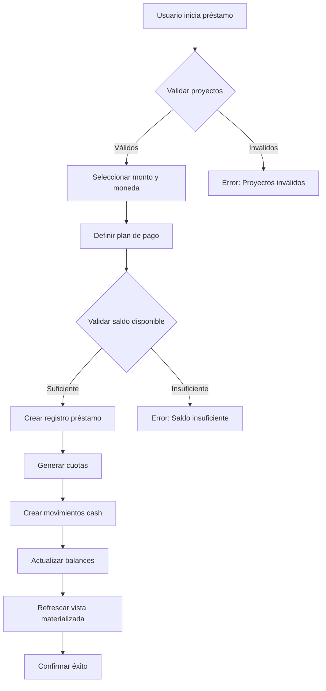
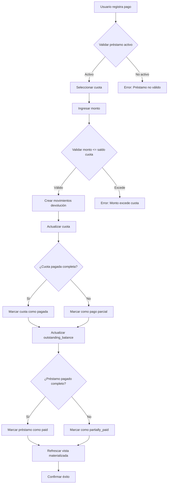

# Arquitectura del Sistema de Caja Maestra (Master Cash)

**Versión:** 2.0
**Fecha:** 30 de Enero de 2025
**Estado:** Diseño Propuesto

---

## Tabla de Contenidos

1. [Visión General](#visión-general)
2. [Modelo de Datos](#modelo-de-datos)
3. [Flujos de Usuario (UX)](#flujos-de-usuario-ux)
4. [Arquitectura de Componentes](#arquitectura-de-componentes)
5. [Servicios y Lógica de Negocio](#servicios-y-lógica-de-negocio)
6. [Trazabilidad y Auditoría](#trazabilidad-y-auditoría)
7. [Casos de Uso Detallados](#casos-de-uso-detallados)

---

## Visión General

### Concepto de Caja Maestra

La **Caja Maestra** funciona como una **financiera interna** que centraliza el dinero de todos los proyectos del estudio, permitiendo:

- **Gestión Centralizada de Liquidez**: Pool de fondos disponibles en ARS y USD
- **Préstamos Inter-Proyectos**: Proyectos con superávit prestan a proyectos necesitados
- **Trazabilidad Total**: Cada peso/dólar tiene origen, destino y estado de deuda
- **Gestión de Honorarios**: Pagos desde la caja maestra a externos
- **Transferencias Bancarias**: Movimientos entre cuentas bancarias del estudio

### Principios Fundamentales

1. **Trazabilidad Completa**: Todo movimiento debe tener origen y destino claramente definido
2. **Balance Exacto**: Los balances de la caja maestra deben cuadrar con las deudas inter-proyectos
3. **Auditabilidad**: Historial completo e inmutable de todas las transacciones
4. **Multi-Moneda**: Soporte nativo para ARS y USD con conversiones rastreadas

---

## Modelo de Datos

### 1. Extensiones a Tablas Existentes

#### 1.1 `master_cash_box` (Existente - Extender)

```sql
-- Tabla principal de la caja maestra
CREATE TABLE master_cash_box (
  id UUID PRIMARY KEY DEFAULT gen_random_uuid(),

  -- Balances por moneda
  balance_ars DECIMAL(15,2) NOT NULL DEFAULT 0,
  balance_usd DECIMAL(15,2) NOT NULL DEFAULT 0,

  -- Balance equivalente en ARS (para visualización)
  current_balance_ars DECIMAL(15,2) NOT NULL DEFAULT 0,

  -- Totales acumulados
  total_income_ars DECIMAL(15,2) NOT NULL DEFAULT 0,
  total_income_usd DECIMAL(15,2) NOT NULL DEFAULT 0,
  total_expenses_ars DECIMAL(15,2) NOT NULL DEFAULT 0,
  total_expenses_usd DECIMAL(15,2) NOT NULL DEFAULT 0,

  -- NUEVO: Totales de préstamos
  total_loans_given_ars DECIMAL(15,2) NOT NULL DEFAULT 0,
  total_loans_given_usd DECIMAL(15,2) NOT NULL DEFAULT 0,
  total_loans_received_ars DECIMAL(15,2) NOT NULL DEFAULT 0,
  total_loans_received_usd DECIMAL(15,2) NOT NULL DEFAULT 0,

  -- NUEVO: Deudas pendientes
  outstanding_receivables_ars DECIMAL(15,2) NOT NULL DEFAULT 0, -- Lo que le deben a la caja
  outstanding_receivables_usd DECIMAL(15,2) NOT NULL DEFAULT 0,
  outstanding_payables_ars DECIMAL(15,2) NOT NULL DEFAULT 0,    -- Lo que la caja debe
  outstanding_payables_usd DECIMAL(15,2) NOT NULL DEFAULT 0,

  -- Metadata
  last_movement_at TIMESTAMP WITH TIME ZONE,
  created_at TIMESTAMP WITH TIME ZONE DEFAULT NOW() NOT NULL,
  updated_at TIMESTAMP WITH TIME ZONE DEFAULT NOW() NOT NULL,

  -- Constraints
  CONSTRAINT check_balance_ars_positive CHECK (balance_ars >= 0),
  CONSTRAINT check_balance_usd_positive CHECK (balance_usd >= 0)
);

-- Índices
CREATE INDEX idx_master_cash_box_updated_at ON master_cash_box(updated_at DESC);
```

#### 1.2 `cash_movements` (Existente - Extender tipos)

```sql
-- Tipos de movimientos existentes + nuevos
ALTER TYPE movement_type ADD VALUE IF NOT EXISTS 'inter_project_loan';
ALTER TYPE movement_type ADD VALUE IF NOT EXISTS 'loan_repayment';
ALTER TYPE movement_type ADD VALUE IF NOT EXISTS 'loan_interest';
ALTER TYPE movement_type ADD VALUE IF NOT EXISTS 'advance_to_project';
ALTER TYPE movement_type ADD VALUE IF NOT EXISTS 'bank_account_transfer';
ALTER TYPE movement_type ADD VALUE IF NOT EXISTS 'currency_exchange';

-- Nueva columna para rastrear el préstamo asociado
ALTER TABLE cash_movements
  ADD COLUMN IF NOT EXISTS loan_id UUID REFERENCES inter_project_loans(id),
  ADD COLUMN IF NOT EXISTS installment_number INTEGER,
  ADD COLUMN IF NOT EXISTS currency VARCHAR(3) DEFAULT 'ARS',
  ADD COLUMN IF NOT EXISTS exchange_rate DECIMAL(10,4) DEFAULT 1;
```

### 2. Nuevas Tablas

#### 2.1 `inter_project_loans` (NUEVA)

Tabla central para rastrear préstamos entre proyectos a través de la caja maestra.

```sql
CREATE TABLE inter_project_loans (
  id UUID PRIMARY KEY DEFAULT gen_random_uuid(),

  -- Identificación del préstamo
  loan_number VARCHAR(50) UNIQUE NOT NULL, -- Ej: "LOAN-2025-001"

  -- Proyecto prestamista (quien da el dinero)
  lender_project_id UUID NOT NULL REFERENCES projects(id),
  lender_project_name VARCHAR(255) NOT NULL, -- Desnormalizado para histórico

  -- Proyecto prestatario (quien recibe el dinero)
  borrower_project_id UUID NOT NULL REFERENCES projects(id),
  borrower_project_name VARCHAR(255) NOT NULL, -- Desnormalizado para histórico

  -- Detalles financieros
  loan_amount DECIMAL(15,2) NOT NULL,
  currency VARCHAR(3) NOT NULL DEFAULT 'ARS',
  interest_rate DECIMAL(5,2) DEFAULT 0, -- Tasa de interés (0 = sin interés)

  -- Plan de pago
  installments_count INTEGER NOT NULL DEFAULT 1,
  installment_amount DECIMAL(15,2),
  payment_frequency VARCHAR(20) DEFAULT 'monthly', -- 'monthly', 'quarterly', 'lump_sum'

  -- Fechas
  loan_date TIMESTAMP WITH TIME ZONE NOT NULL DEFAULT NOW(),
  first_payment_date DATE,
  expected_completion_date DATE,
  actual_completion_date DATE,

  -- Estados del préstamo
  status VARCHAR(20) NOT NULL DEFAULT 'active',
  -- 'pending': Aprobado pero no desembolsado
  -- 'active': Desembolsado y vigente
  -- 'partially_paid': Con pagos parciales
  -- 'paid': Totalmente pagado
  -- 'defaulted': En mora
  -- 'cancelled': Cancelado

  -- Montos rastreados
  total_paid DECIMAL(15,2) NOT NULL DEFAULT 0,
  total_interest_paid DECIMAL(15,2) NOT NULL DEFAULT 0,
  outstanding_balance DECIMAL(15,2) NOT NULL DEFAULT 0,

  -- Movimientos relacionados
  disbursement_movement_id UUID REFERENCES cash_movements(id), -- Movimiento de desembolso

  -- Metadata
  notes TEXT,
  approval_reason TEXT,
  approved_by UUID REFERENCES auth.users(id),
  created_by UUID REFERENCES auth.users(id),
  created_at TIMESTAMP WITH TIME ZONE DEFAULT NOW() NOT NULL,
  updated_at TIMESTAMP WITH TIME ZONE DEFAULT NOW() NOT NULL,

  -- Constraints
  CONSTRAINT check_loan_amount_positive CHECK (loan_amount > 0),
  CONSTRAINT check_interest_rate_valid CHECK (interest_rate >= 0 AND interest_rate <= 100),
  CONSTRAINT check_installments_positive CHECK (installments_count > 0),
  CONSTRAINT check_outstanding_balance_valid CHECK (outstanding_balance >= 0),
  CONSTRAINT check_total_paid_valid CHECK (total_paid >= 0),
  CONSTRAINT check_different_projects CHECK (lender_project_id != borrower_project_id),
  CONSTRAINT check_currency_valid CHECK (currency IN ('ARS', 'USD'))
);

-- Índices
CREATE INDEX idx_inter_project_loans_lender ON inter_project_loans(lender_project_id);
CREATE INDEX idx_inter_project_loans_borrower ON inter_project_loans(borrower_project_id);
CREATE INDEX idx_inter_project_loans_status ON inter_project_loans(status);
CREATE INDEX idx_inter_project_loans_loan_date ON inter_project_loans(loan_date DESC);
CREATE INDEX idx_inter_project_loans_currency ON inter_project_loans(currency);

-- Comentarios
COMMENT ON TABLE inter_project_loans IS 'Préstamos entre proyectos intermediados por la caja maestra';
COMMENT ON COLUMN inter_project_loans.lender_project_id IS 'Proyecto que presta el dinero (aportante a caja maestra)';
COMMENT ON COLUMN inter_project_loans.borrower_project_id IS 'Proyecto que recibe el préstamo desde caja maestra';
COMMENT ON COLUMN inter_project_loans.outstanding_balance IS 'Saldo pendiente de pago';
```

#### 2.2 `loan_installments` (NUEVA)

Tabla para rastrear cada cuota de un préstamo inter-proyectos.

```sql
CREATE TABLE loan_installments (
  id UUID PRIMARY KEY DEFAULT gen_random_uuid(),

  -- Relación con préstamo
  loan_id UUID NOT NULL REFERENCES inter_project_loans(id) ON DELETE CASCADE,

  -- Número de cuota
  installment_number INTEGER NOT NULL,

  -- Montos
  principal_amount DECIMAL(15,2) NOT NULL,
  interest_amount DECIMAL(15,2) NOT NULL DEFAULT 0,
  total_amount DECIMAL(15,2) NOT NULL,
  paid_amount DECIMAL(15,2) NOT NULL DEFAULT 0,

  -- Fechas
  due_date DATE NOT NULL,
  paid_date DATE,

  -- Estado
  status VARCHAR(20) NOT NULL DEFAULT 'pending',
  -- 'pending': Pendiente de pago
  -- 'partial': Pagado parcialmente
  -- 'paid': Pagado completamente
  -- 'overdue': Vencido
  -- 'waived': Condonado

  -- Movimiento de pago asociado
  payment_movement_id UUID REFERENCES cash_movements(id),

  -- Penalidades por mora
  late_fee_amount DECIMAL(15,2) DEFAULT 0,
  days_overdue INTEGER DEFAULT 0,

  -- Metadata
  notes TEXT,
  created_at TIMESTAMP WITH TIME ZONE DEFAULT NOW() NOT NULL,
  updated_at TIMESTAMP WITH TIME ZONE DEFAULT NOW() NOT NULL,

  -- Constraints
  CONSTRAINT check_amounts_positive CHECK (
    principal_amount >= 0 AND
    interest_amount >= 0 AND
    total_amount >= 0 AND
    paid_amount >= 0
  ),
  CONSTRAINT check_paid_not_exceeds_total CHECK (paid_amount <= total_amount),
  CONSTRAINT check_total_amount_correct CHECK (total_amount = principal_amount + interest_amount),
  CONSTRAINT unique_loan_installment UNIQUE (loan_id, installment_number)
);

-- Índices
CREATE INDEX idx_loan_installments_loan_id ON loan_installments(loan_id);
CREATE INDEX idx_loan_installments_status ON loan_installments(status);
CREATE INDEX idx_loan_installments_due_date ON loan_installments(due_date);
CREATE INDEX idx_loan_installments_paid_date ON loan_installments(paid_date DESC);

-- Comentarios
COMMENT ON TABLE loan_installments IS 'Cuotas individuales de préstamos inter-proyectos';
COMMENT ON COLUMN loan_installments.principal_amount IS 'Capital de la cuota';
COMMENT ON COLUMN loan_installments.interest_amount IS 'Interés de la cuota';
```

#### 2.3 `bank_accounts` (NUEVA)

Tabla para rastrear cuentas bancarias del estudio.

```sql
CREATE TABLE bank_accounts (
  id UUID PRIMARY KEY DEFAULT gen_random_uuid(),

  -- Información del banco
  bank_name VARCHAR(100) NOT NULL,
  account_type VARCHAR(20) NOT NULL, -- 'checking', 'savings', 'investment'
  account_number VARCHAR(100) NOT NULL,
  account_alias VARCHAR(100),

  -- Moneda y balance
  currency VARCHAR(3) NOT NULL DEFAULT 'ARS',
  current_balance DECIMAL(15,2) NOT NULL DEFAULT 0,

  -- CBU/CVU para transferencias
  cbu_cvu VARCHAR(22),

  -- Estado
  status VARCHAR(20) NOT NULL DEFAULT 'active', -- 'active', 'inactive', 'closed'

  -- Metadata
  notes TEXT,
  created_at TIMESTAMP WITH TIME ZONE DEFAULT NOW() NOT NULL,
  updated_at TIMESTAMP WITH TIME ZONE DEFAULT NOW() NOT NULL,

  -- Constraints
  CONSTRAINT check_currency_valid CHECK (currency IN ('ARS', 'USD')),
  CONSTRAINT unique_account_number UNIQUE (bank_name, account_number)
);

-- Índices
CREATE INDEX idx_bank_accounts_currency ON bank_accounts(currency);
CREATE INDEX idx_bank_accounts_status ON bank_accounts(status);

-- Comentarios
COMMENT ON TABLE bank_accounts IS 'Cuentas bancarias del estudio para gestión de liquidez';
```

#### 2.4 `bank_account_transfers` (NUEVA)

Tabla para rastrear transferencias entre cuentas bancarias.

```sql
CREATE TABLE bank_account_transfers (
  id UUID PRIMARY KEY DEFAULT gen_random_uuid(),

  -- Cuentas origen y destino
  from_account_id UUID NOT NULL REFERENCES bank_accounts(id),
  to_account_id UUID NOT NULL REFERENCES bank_accounts(id),

  -- Montos
  amount DECIMAL(15,2) NOT NULL,
  currency VARCHAR(3) NOT NULL,

  -- Conversión de moneda (si aplica)
  exchange_rate DECIMAL(10,4) DEFAULT 1,
  converted_amount DECIMAL(15,2),

  -- Movimientos relacionados
  outbound_movement_id UUID REFERENCES cash_movements(id),
  inbound_movement_id UUID REFERENCES cash_movements(id),

  -- Estado
  status VARCHAR(20) NOT NULL DEFAULT 'pending',
  -- 'pending': Pendiente de ejecución
  -- 'processing': En proceso
  -- 'completed': Completada
  -- 'failed': Falló
  -- 'cancelled': Cancelada

  -- Metadata
  reference_number VARCHAR(100),
  notes TEXT,
  transfer_date TIMESTAMP WITH TIME ZONE DEFAULT NOW(),
  completed_at TIMESTAMP WITH TIME ZONE,
  created_by UUID REFERENCES auth.users(id),
  created_at TIMESTAMP WITH TIME ZONE DEFAULT NOW() NOT NULL,
  updated_at TIMESTAMP WITH TIME ZONE DEFAULT NOW() NOT NULL,

  -- Constraints
  CONSTRAINT check_amount_positive CHECK (amount > 0),
  CONSTRAINT check_different_accounts CHECK (from_account_id != to_account_id),
  CONSTRAINT check_currency_valid CHECK (currency IN ('ARS', 'USD'))
);

-- Índices
CREATE INDEX idx_bank_transfers_from_account ON bank_account_transfers(from_account_id);
CREATE INDEX idx_bank_transfers_to_account ON bank_account_transfers(to_account_id);
CREATE INDEX idx_bank_transfers_status ON bank_account_transfers(status);
CREATE INDEX idx_bank_transfers_date ON bank_account_transfers(transfer_date DESC);

-- Comentarios
COMMENT ON TABLE bank_account_transfers IS 'Transferencias entre cuentas bancarias del estudio';
```

#### 2.5 `loan_balance_ledger` (NUEVA - Vista Materializada)

Vista materializada para balance de deudas en tiempo real.

```sql
CREATE MATERIALIZED VIEW loan_balance_ledger AS
SELECT
  p.id AS project_id,
  p.name AS project_name,

  -- Como prestamista (lo que le deben al proyecto)
  COALESCE(SUM(
    CASE WHEN l.lender_project_id = p.id AND l.currency = 'ARS'
    THEN l.outstanding_balance ELSE 0 END
  ), 0) AS receivables_ars,

  COALESCE(SUM(
    CASE WHEN l.lender_project_id = p.id AND l.currency = 'USD'
    THEN l.outstanding_balance ELSE 0 END
  ), 0) AS receivables_usd,

  -- Como prestatario (lo que el proyecto debe)
  COALESCE(SUM(
    CASE WHEN l.borrower_project_id = p.id AND l.currency = 'ARS'
    THEN l.outstanding_balance ELSE 0 END
  ), 0) AS payables_ars,

  COALESCE(SUM(
    CASE WHEN l.borrower_project_id = p.id AND l.currency = 'USD'
    THEN l.outstanding_balance ELSE 0 END
  ), 0) AS payables_usd,

  -- Balance neto
  COALESCE(SUM(
    CASE WHEN l.lender_project_id = p.id AND l.currency = 'ARS'
    THEN l.outstanding_balance
    WHEN l.borrower_project_id = p.id AND l.currency = 'ARS'
    THEN -l.outstanding_balance
    ELSE 0 END
  ), 0) AS net_balance_ars,

  COALESCE(SUM(
    CASE WHEN l.lender_project_id = p.id AND l.currency = 'USD'
    THEN l.outstanding_balance
    WHEN l.borrower_project_id = p.id AND l.currency = 'USD'
    THEN -l.outstanding_balance
    ELSE 0 END
  ), 0) AS net_balance_usd,

  -- Cantidades de préstamos
  COUNT(DISTINCT CASE WHEN l.lender_project_id = p.id THEN l.id END) AS loans_given_count,
  COUNT(DISTINCT CASE WHEN l.borrower_project_id = p.id THEN l.id END) AS loans_received_count,

  NOW() AS last_updated

FROM projects p
LEFT JOIN inter_project_loans l ON (
  l.lender_project_id = p.id OR l.borrower_project_id = p.id
) AND l.status IN ('active', 'partially_paid')
GROUP BY p.id, p.name;

-- Índices
CREATE UNIQUE INDEX idx_loan_balance_ledger_project_id ON loan_balance_ledger(project_id);
CREATE INDEX idx_loan_balance_ledger_receivables ON loan_balance_ledger(receivables_ars DESC, receivables_usd DESC);
CREATE INDEX idx_loan_balance_ledger_payables ON loan_balance_ledger(payables_ars DESC, payables_usd DESC);

-- Función para refrescar
CREATE OR REPLACE FUNCTION refresh_loan_balance_ledger()
RETURNS void AS $$
BEGIN
  REFRESH MATERIALIZED VIEW CONCURRENTLY loan_balance_ledger;
END;
$$ LANGUAGE plpgsql;

-- Comentarios
COMMENT ON MATERIALIZED VIEW loan_balance_ledger IS 'Balance consolidado de deudas inter-proyectos por proyecto';
```

### 3. Funciones y Triggers

#### 3.1 Función de Validación de Préstamos

```sql
CREATE OR REPLACE FUNCTION validate_inter_project_loan()
RETURNS TRIGGER AS $$
BEGIN
  -- Validar que los proyectos existen y están activos
  IF NOT EXISTS (
    SELECT 1 FROM projects
    WHERE id = NEW.lender_project_id
    AND status IN ('active', 'on_hold')
  ) THEN
    RAISE EXCEPTION 'Proyecto prestamista no válido o inactivo';
  END IF;

  IF NOT EXISTS (
    SELECT 1 FROM projects
    WHERE id = NEW.borrower_project_id
    AND status IN ('active', 'on_hold')
  ) THEN
    RAISE EXCEPTION 'Proyecto prestatario no válido o inactivo';
  END IF;

  -- Calcular outstanding_balance inicial
  IF NEW.outstanding_balance IS NULL OR NEW.outstanding_balance = 0 THEN
    NEW.outstanding_balance := NEW.loan_amount + (NEW.loan_amount * NEW.interest_rate / 100);
  END IF;

  -- Generar loan_number si no existe
  IF NEW.loan_number IS NULL THEN
    NEW.loan_number := 'LOAN-' || TO_CHAR(NOW(), 'YYYY-MM-DD-') ||
                       LPAD(NEXTVAL('loan_number_seq')::TEXT, 4, '0');
  END IF;

  RETURN NEW;
END;
$$ LANGUAGE plpgsql;

-- Crear secuencia para loan_number
CREATE SEQUENCE IF NOT EXISTS loan_number_seq START 1;

-- Trigger
CREATE TRIGGER trigger_validate_inter_project_loan
  BEFORE INSERT OR UPDATE ON inter_project_loans
  FOR EACH ROW
  EXECUTE FUNCTION validate_inter_project_loan();
```

#### 3.2 Función de Actualización de Balance de Préstamo

```sql
CREATE OR REPLACE FUNCTION update_loan_outstanding_balance()
RETURNS TRIGGER AS $$
DECLARE
  loan_record inter_project_loans;
BEGIN
  -- Obtener el préstamo
  SELECT * INTO loan_record
  FROM inter_project_loans
  WHERE id = NEW.loan_id;

  IF loan_record IS NULL THEN
    RETURN NEW;
  END IF;

  -- Actualizar outstanding_balance del préstamo
  UPDATE inter_project_loans
  SET
    total_paid = (
      SELECT COALESCE(SUM(paid_amount), 0)
      FROM loan_installments
      WHERE loan_id = NEW.loan_id
    ),
    outstanding_balance = loan_amount + (loan_amount * interest_rate / 100) - (
      SELECT COALESCE(SUM(paid_amount), 0)
      FROM loan_installments
      WHERE loan_id = NEW.loan_id
    ),
    status = CASE
      WHEN (
        SELECT COALESCE(SUM(paid_amount), 0)
        FROM loan_installments
        WHERE loan_id = NEW.loan_id
      ) >= loan_amount + (loan_amount * interest_rate / 100) THEN 'paid'
      WHEN (
        SELECT COUNT(*)
        FROM loan_installments
        WHERE loan_id = NEW.loan_id AND paid_amount > 0
      ) > 0 THEN 'partially_paid'
      ELSE status
    END,
    actual_completion_date = CASE
      WHEN (
        SELECT COALESCE(SUM(paid_amount), 0)
        FROM loan_installments
        WHERE loan_id = NEW.loan_id
      ) >= loan_amount + (loan_amount * interest_rate / 100) THEN NOW()
      ELSE actual_completion_date
    END,
    updated_at = NOW()
  WHERE id = NEW.loan_id;

  -- Refrescar vista materializada
  PERFORM refresh_loan_balance_ledger();

  RETURN NEW;
END;
$$ LANGUAGE plpgsql;

-- Trigger
CREATE TRIGGER trigger_update_loan_balance
  AFTER INSERT OR UPDATE ON loan_installments
  FOR EACH ROW
  EXECUTE FUNCTION update_loan_outstanding_balance();
```

#### 3.3 Función de Actualización de Caja Maestra

```sql
CREATE OR REPLACE FUNCTION update_master_cash_balance()
RETURNS TRIGGER AS $$
DECLARE
  master_box master_cash_box;
BEGIN
  -- Obtener la caja maestra (asumimos una sola instancia)
  SELECT * INTO master_box FROM master_cash_box LIMIT 1;

  IF master_box IS NULL THEN
    RAISE EXCEPTION 'Caja maestra no inicializada';
  END IF;

  -- Actualizar balances según tipo de movimiento
  IF NEW.movement_type = 'inter_project_loan' THEN
    -- Préstamo otorgado: reduce balance disponible
    IF NEW.currency = 'ARS' THEN
      UPDATE master_cash_box SET
        balance_ars = balance_ars - ABS(NEW.amount),
        total_loans_given_ars = total_loans_given_ars + ABS(NEW.amount),
        outstanding_receivables_ars = outstanding_receivables_ars + ABS(NEW.amount),
        updated_at = NOW();
    ELSIF NEW.currency = 'USD' THEN
      UPDATE master_cash_box SET
        balance_usd = balance_usd - ABS(NEW.amount),
        total_loans_given_usd = total_loans_given_usd + ABS(NEW.amount),
        outstanding_receivables_usd = outstanding_receivables_usd + ABS(NEW.amount),
        updated_at = NOW();
    END IF;

  ELSIF NEW.movement_type = 'loan_repayment' THEN
    -- Devolución de préstamo: aumenta balance disponible
    IF NEW.currency = 'ARS' THEN
      UPDATE master_cash_box SET
        balance_ars = balance_ars + ABS(NEW.amount),
        outstanding_receivables_ars = GREATEST(0, outstanding_receivables_ars - ABS(NEW.amount)),
        updated_at = NOW();
    ELSIF NEW.currency = 'USD' THEN
      UPDATE master_cash_box SET
        balance_usd = balance_usd + ABS(NEW.amount),
        outstanding_receivables_usd = GREATEST(0, outstanding_receivables_usd - ABS(NEW.amount)),
        updated_at = NOW();
    END IF;
  END IF;

  RETURN NEW;
END;
$$ LANGUAGE plpgsql;

-- Trigger
CREATE TRIGGER trigger_update_master_cash_balance
  AFTER INSERT ON cash_movements
  FOR EACH ROW
  WHEN (NEW.movement_type IN ('inter_project_loan', 'loan_repayment'))
  EXECUTE FUNCTION update_master_cash_balance();
```

---

## Flujos de Usuario (UX)

### Flujo 1: Crear Préstamo Inter-Proyectos

**Actor:** Administrador financiero
**Objetivo:** Registrar un préstamo desde un proyecto con superávit hacia un proyecto necesitado

**Pasos:**

1. **Navegación inicial**
   - Usuario accede al dashboard de Caja Maestra
   - Hace clic en "Gestión de Préstamos" → "Nuevo Préstamo"

2. **Formulario de préstamo (Modal)**
   - **Paso 1: Selección de proyectos**
     ```
     [Dropdown] Proyecto Prestamista (con saldo positivo)
     [Dropdown] Proyecto Prestatario (necesita fondos)
     [Info Badge] Saldo disponible proyecto prestamista: $500,000 ARS
     ```

   - **Paso 2: Detalles financieros**
     ```
     [Input] Monto del préstamo: _________ [Dropdown: ARS/USD]
     [Input] Tasa de interés (%): _____ (Opcional, default: 0%)
     [Checkbox] ¿Sin interés? (préstamo solidario)
     ```

   - **Paso 3: Plan de pago**
     ```
     [Radio] Tipo de pago:
       ( ) Pago único
       ( ) Cuotas mensuales
       ( ) Cuotas trimestrales
       ( ) Personalizado

     [Input] Cantidad de cuotas: _____
     [DatePicker] Fecha primer pago: [  /  /    ]
     [Info] Monto por cuota: $125,000 ARS
     ```

   - **Paso 4: Confirmación**
     ```
     [Panel de resumen]
     Proyecto Origen: Edificio Torre Central
     Proyecto Destino: Casa Barrio Norte
     Monto: $500,000 ARS
     Cuotas: 4 mensuales de $125,000
     Tasa: 0% (préstamo solidario)
     Fecha inicio: 01/02/2025

     [Textarea] Motivo/Notas: _________________________

     [Button Primary] Aprobar y Desembolsar
     [Button Secondary] Guardar como pendiente
     [Button Ghost] Cancelar
     ```

3. **Procesamiento transaccional**
   - Sistema valida saldo disponible en proyecto prestamista
   - Crea registro en `inter_project_loans`
   - Genera cuotas en `loan_installments`
   - Crea movimientos en `cash_movements`:
     - Salida del proyecto prestamista → Caja Maestra
     - Salida de Caja Maestra → Proyecto prestatario
   - Actualiza balances de proyectos y caja maestra
   - Refresca vista materializada `loan_balance_ledger`

4. **Confirmación y notificación**
   ```
   [Success Modal]
   ✓ Préstamo creado exitosamente
   Nº de Préstamo: LOAN-2025-001

   Resumen:
   - Desembolso completado: $500,000 ARS
   - Primera cuota vence: 01/03/2025
   - Proyecto Barrio Norte ahora tiene $500,000 disponibles

   [Button] Ver detalle del préstamo
   [Button] Imprimir comprobante
   [Button] Volver a caja maestra
   ```

**Componentes UI involucrados:**
- `Modal` (del design system)
- `MoneyInput` (para montos con formato)
- `DateRangePicker` (para fechas de pago)
- `ConfirmDialog` (para confirmación final)
- `SuccessModal` (para resultado exitoso)

---

### Flujo 2: Registrar Devolución de Préstamo

**Actor:** Administrador financiero
**Objetivo:** Registrar el pago de una cuota o pago total de un préstamo

**Pasos:**

1. **Navegación inicial**
   - Usuario accede a "Caja Maestra" → "Préstamos Activos"
   - Ve tabla con préstamos pendientes:

   ```
   [DataTable]
   ┌─────────────────┬──────────────┬─────────────────┬──────────────┬──────────────┬──────────┐
   │ Nº Préstamo     │ Prestamista  │ Prestatario     │ Monto        │ Pendiente    │ Acciones │
   ├─────────────────┼──────────────┼─────────────────┼──────────────┼──────────────┼──────────┤
   │ LOAN-2025-001   │ Torre Centr. │ Barrio Norte    │ $500,000     │ $375,000     │ [Pagar]  │
   │ LOAN-2025-002   │ Shopping XY  │ Oficinas Park   │ $1,200,000   │ $1,200,000   │ [Pagar]  │
   └─────────────────┴──────────────┴─────────────────┴──────────────┴──────────────┴──────────┘
   ```

2. **Selección de préstamo**
   - Usuario hace clic en [Pagar] → Abre modal de pago

3. **Modal de registro de pago**
   ```
   [Modal: Registrar Pago de Préstamo]

   Préstamo: LOAN-2025-001
   De: Barrio Norte → Torre Central (vía Caja Maestra)

   [Info Panel]
   Saldo pendiente: $375,000 ARS
   Próxima cuota (#2): $125,000 ARS - Vence: 01/03/2025

   [Radio] Tipo de pago:
     (•) Pago de cuota programada
     ( ) Pago parcial
     ( ) Pago total del préstamo

   [Input] Monto a pagar: _________ ARS
   [Info] Aplicado a: Cuota #2 (Capital: $125,000)

   [DatePicker] Fecha de pago: [ 28/02/2025 ]

   [Dropdown] Método de pago:
     - Transferencia desde proyecto
     - Efectivo
     - Descuento de ingresos futuros

   [Textarea] Notas: _________________________

   [Button Primary] Confirmar Pago
   [Button Ghost] Cancelar
   ```

4. **Procesamiento de pago**
   - Sistema valida saldo disponible en proyecto prestatario
   - Actualiza `loan_installments` → marca cuota como pagada
   - Crea movimientos en `cash_movements`:
     - Salida del proyecto prestatario → Caja Maestra
     - Salida de Caja Maestra → Proyecto prestamista (devolución)
   - Actualiza `inter_project_loans`:
     - `total_paid` += monto
     - `outstanding_balance` -= monto
     - `status` = 'partially_paid' o 'paid'
   - Refresca `loan_balance_ledger`

5. **Confirmación**
   ```
   [Success Toast]
   ✓ Pago registrado exitosamente
   Cuota #2 marcada como pagada
   Saldo pendiente: $250,000 ARS
   Próxima cuota: 01/04/2025
   ```

**Componentes UI involucrados:**
- `DataTable` (tabla de préstamos activos)
- `Modal` (formulario de pago)
- `MoneyInput` (monto con validación)
- `DateRangePicker` (fecha de pago)
- Success Toast (confirmación rápida)

---

### Flujo 3: Transferencia Entre Cuentas Bancarias

**Actor:** Administrador financiero
**Objetivo:** Mover dinero entre cuentas bancarias del estudio

**Pasos:**

1. **Navegación inicial**
   - Usuario accede a "Caja Maestra" → "Cuentas Bancarias"
   - Ve panel con saldos:

   ```
   [MetricGrid columns=3]
   ┌─────────────────────────────────────┐
   │ Banco Galicia - Cta Cte ARS        │
   │ Balance: $2,500,000                │
   │ [Transferir] [Ver movimientos]     │
   └─────────────────────────────────────┘

   ┌─────────────────────────────────────┐
   │ Banco Santander - Caja Ahorro USD  │
   │ Balance: $15,000 USD               │
   │ [Transferir] [Ver movimientos]     │
   └─────────────────────────────────────┘
   ```

2. **Iniciar transferencia**
   - Usuario hace clic en [Transferir] → Abre modal

3. **Modal de transferencia**
   ```
   [Modal: Transferencia Entre Cuentas]

   [Dropdown] Cuenta origen:
     Banco Galicia - Cta Cte ARS ($2,500,000)

   [Dropdown] Cuenta destino:
     Banco Santander - Caja Ahorro ARS ($800,000)

   [Input] Monto a transferir: _________ ARS
   [Info] Comisión estimada: $500 ARS
   [Info] Total a debitar: $_________ ARS

   [Checkbox] ¿Transferencia inmediata? (24hs vs inmediata)

   [Input] Nº de referencia/comprobante: _________

   [Textarea] Motivo: _________________________

   [Warning Banner]
   ⚠️ Esta operación debitará fondos de la cuenta origen inmediatamente.
   El acreditamiento en destino puede demorar 24-48hs.

   [Button Primary] Ejecutar Transferencia
   [Button Ghost] Cancelar
   ```

4. **Procesamiento**
   - Crea registro en `bank_account_transfers`
   - Crea movimientos en `cash_movements`:
     - Salida de cuenta origen
     - Entrada a cuenta destino (con estado "pending" si no es inmediata)
   - Actualiza balances en `bank_accounts`
   - Registra en caja maestra si involucra fondos de proyectos

5. **Confirmación**
   ```
   [Success Modal]
   ✓ Transferencia iniciada
   Nº de operación: TRF-2025-001

   Origen: Banco Galicia ARS
   Destino: Banco Santander ARS
   Monto: $500,000 ARS
   Estado: Procesando (acreditación en 24hs)

   [Button] Ver comprobante
   [Button] Volver a cuentas
   ```

**Componentes UI involucrados:**
- `MetricGrid` (resumen de cuentas)
- `StatCard` (cada cuenta bancaria)
- `Modal` (formulario de transferencia)
- `MoneyInput` (monto con formato)
- `Alert` (warning sobre tiempos)
- `ConfirmDialog` (confirmación final)

---

### Flujo 4: Pago de Honorarios desde Caja Maestra

**Actor:** Administrador financiero
**Objetivo:** Pagar honorarios profesionales a externos usando fondos centralizados

**Pasos:**

1. **Navegación inicial**
   - Usuario accede a "Caja Maestra" → "Nuevo Movimiento"
   - Selecciona tipo: "Pago de Honorarios"

2. **Formulario de honorarios**
   ```
   [Modal: Pago de Honorarios]

   [Dropdown] Beneficiario:
     [Search + Select de providers tipo "professional"]
     - Arq. Juan Pérez (CUIT: 20-12345678-9)
     - Ing. María González (CUIT: 27-98765432-1)
     + Nuevo beneficiario

   [Input] Monto: _________ [Dropdown: ARS/USD]

   [Dropdown] Concepto:
     - Dirección de obra
     - Cálculo estructural
     - Asesoría legal
     - Honorarios profesionales
     - Otro

   [Dropdown] Proyecto relacionado: (Opcional)
     - Barrio Norte
     - Torre Central
     - Sin proyecto específico

   [Dropdown] Método de pago:
     - Transferencia bancaria
     - Efectivo
     - Cheque

   [Input] CBU/Alias/Cuenta: _________________________

   [Input] Nº de factura/recibo: _________

   [DatePicker] Fecha de pago: [ 30/01/2025 ]

   [Textarea] Descripción: _________________________

   [Info Panel]
   Balance disponible en caja maestra:
   - ARS: $3,200,000
   - USD: $25,000

   [Button Primary] Registrar Pago
   [Button Ghost] Cancelar
   ```

3. **Validaciones**
   - Sistema verifica saldo disponible en caja maestra
   - Valida datos del beneficiario
   - Si método es transferencia, valida CBU/Alias

4. **Procesamiento**
   - Crea movimiento en `cash_movements`:
     - `movement_type` = 'honorarium_payment'
     - `source_type` = 'master'
     - `destination_type` = 'external'
     - Vincula a `provider` si existe
   - Reduce balance de caja maestra según moneda
   - Si hay proyecto relacionado, registra también en gastos del proyecto

5. **Confirmación**
   ```
   [Success Toast]
   ✓ Pago de honorarios registrado
   Beneficiario: Arq. Juan Pérez
   Monto: $150,000 ARS
   Balance restante: $3,050,000 ARS
   ```

**Componentes UI involucrados:**
- `Modal` (formulario de pago)
- `SearchCommand` (búsqueda de beneficiarios)
- `MoneyInput` (monto)
- `DateRangePicker` (fecha)
- `Input` (CBU con validación)
- Success Toast (confirmación)

---

## Arquitectura de Componentes

### Estructura de Módulos

```
src/modules/finance/
├── components/
│   ├── MasterCash/
│   │   ├── MasterCashDashboard.tsx          # Dashboard principal
│   │   ├── MasterCashBalanceCards.tsx       # Cards de balance ARS/USD
│   │   ├── MasterCashTransactionList.tsx    # Lista de movimientos
│   │   └── MasterCashFilters.tsx            # Filtros y búsqueda
│   │
│   ├── InterProjectLoans/
│   │   ├── LoansDashboard.tsx               # Dashboard de préstamos
│   │   ├── LoansList.tsx                    # Tabla de préstamos activos
│   │   ├── LoanDetail.tsx                   # Detalle de un préstamo
│   │   ├── CreateLoanModal.tsx              # Formulario nuevo préstamo
│   │   ├── LoanPaymentModal.tsx             # Formulario de pago
│   │   ├── LoanInstallmentsTable.tsx        # Tabla de cuotas
│   │   └── LoanBalanceLedger.tsx            # Balance de deudas por proyecto
│   │
│   ├── BankAccounts/
│   │   ├── BankAccountsList.tsx             # Lista de cuentas bancarias
│   │   ├── BankAccountCard.tsx              # Card de cuenta individual
│   │   ├── BankTransferModal.tsx            # Formulario de transferencia
│   │   └── BankAccountMovements.tsx         # Movimientos de una cuenta
│   │
│   ├── Honorariums/
│   │   ├── HonorariumPaymentModal.tsx       # Formulario pago honorarios
│   │   └── HonorariumHistory.tsx            # Historial de pagos
│   │
│   └── Shared/
│       ├── CurrencySelector.tsx             # Selector ARS/USD
│       ├── ProjectSelector.tsx              # Selector de proyectos
│       ├── PaymentMethodSelector.tsx        # Selector métodos de pago
│       └── FinancialSummaryCard.tsx         # Card genérico de resumen
│
├── hooks/
│   ├── useMasterCash.ts                     # Hook estado caja maestra
│   ├── useInterProjectLoans.ts              # Hook préstamos
│   ├── useLoanPayment.ts                    # Hook procesamiento pagos
│   ├── useBankAccounts.ts                   # Hook cuentas bancarias
│   └── useBankTransfer.ts                   # Hook transferencias
│
├── services/
│   ├── MasterCashService.ts                 # Servicio caja maestra
│   ├── InterProjectLoanService.ts           # Servicio préstamos
│   ├── BankAccountService.ts                # Servicio cuentas bancarias
│   └── HonorariumService.ts                 # Servicio honorarios
│
└── types/
    ├── masterCash.types.ts                  # Tipos caja maestra
    ├── loans.types.ts                       # Tipos préstamos
    └── bankAccounts.types.ts                # Tipos cuentas bancarias
```

### Componentes Principales

#### 1. `MasterCashDashboard.tsx`

```typescript
import React from 'react';
import { PageContainer } from '@/design-system/components/layout/PageContainer';
import { MetricGrid } from '@/design-system/components/data-display/MetricGrid';
import { DataTable } from '@/design-system/components/data-display/DataTable';
import { QuickActions } from '@/design-system/components/layout/QuickActions';
import MasterCashBalanceCards from './MasterCashBalanceCards';
import MasterCashTransactionList from './MasterCashTransactionList';
import MasterCashFilters from './MasterCashFilters';
import { useMasterCash } from '../../hooks/useMasterCash';

interface MasterCashDashboardProps {
  organizationId: string;
}

export function MasterCashDashboard({ organizationId }: MasterCashDashboardProps) {
  const {
    cashBox,
    transactions,
    loading,
    filters,
    setFilters,
    refreshData
  } = useMasterCash(organizationId);

  const quickActions = [
    {
      label: 'Nuevo Préstamo',
      icon: <HandCoins />,
      onClick: () => openCreateLoanModal(),
      variant: 'primary' as const
    },
    {
      label: 'Pagar Honorarios',
      icon: <Briefcase />,
      onClick: () => openHonorariumModal(),
      variant: 'default' as const
    },
    {
      label: 'Transferencia Bancaria',
      icon: <Building />,
      onClick: () => openBankTransferModal(),
      variant: 'default' as const
    },
    {
      label: 'Exportar',
      icon: <Download />,
      onClick: () => exportTransactions(),
      variant: 'ghost' as const
    }
  ];

  return (
    <PageContainer
      title="Caja Maestra Financiera"
      description="Gestión centralizada de liquidez y préstamos inter-proyectos"
    >
      {/* Quick Actions */}
      <QuickActions actions={quickActions} />

      {/* Balance Cards */}
      <MasterCashBalanceCards
        cashBox={cashBox}
        loading={loading}
        showBalances={true}
      />

      {/* Filters */}
      <MasterCashFilters
        filters={filters}
        onFilterChange={setFilters}
        onExport={exportTransactions}
      />

      {/* Transactions List */}
      <MasterCashTransactionList
        transactions={transactions}
        loading={loading}
        onRefresh={refreshData}
      />

      {/* Modals se manejan con estado global o context */}
    </PageContainer>
  );
}
```

#### 2. `CreateLoanModal.tsx`

```typescript
import React, { useState } from 'react';
import { Modal } from '@/design-system/components/feedback/Modal';
import { MoneyInput } from '@/design-system/components/inputs/MoneyInput';
import { DateRangePicker } from '@/design-system/components/inputs/DateRangePicker';
import { ConfirmDialog } from '@/design-system/components/feedback/ConfirmDialog';
import { useInterProjectLoans } from '../../hooks/useInterProjectLoans';
import type { CreateLoanFormData } from '../../types/loans.types';

interface CreateLoanModalProps {
  isOpen: boolean;
  onClose: () => void;
  onSuccess: () => void;
}

export function CreateLoanModal({ isOpen, onClose, onSuccess }: CreateLoanModalProps) {
  const [step, setStep] = useState(1); // 1: Projects, 2: Details, 3: Payment Plan, 4: Confirm
  const [formData, setFormData] = useState<CreateLoanFormData>({
    lenderProjectId: '',
    borrowerProjectId: '',
    amount: 0,
    currency: 'ARS',
    interestRate: 0,
    installmentsCount: 1,
    paymentFrequency: 'monthly',
    firstPaymentDate: null,
    notes: ''
  });

  const { createLoan, loading } = useInterProjectLoans();

  const handleSubmit = async () => {
    try {
      await createLoan(formData);
      onSuccess();
      onClose();
    } catch (error) {
      // Manejar error
    }
  };

  return (
    <Modal
      isOpen={isOpen}
      onClose={onClose}
      title="Nuevo Préstamo Inter-Proyectos"
      size="lg"
    >
      <div className="space-y-6">
        {/* Stepper de pasos */}
        <ProgressTracker currentStep={step} totalSteps={4} />

        {/* Paso 1: Selección de proyectos */}
        {step === 1 && (
          <ProjectSelectionStep
            formData={formData}
            onChange={setFormData}
            onNext={() => setStep(2)}
          />
        )}

        {/* Paso 2: Detalles financieros */}
        {step === 2 && (
          <FinancialDetailsStep
            formData={formData}
            onChange={setFormData}
            onNext={() => setStep(3)}
            onBack={() => setStep(1)}
          />
        )}

        {/* Paso 3: Plan de pago */}
        {step === 3 && (
          <PaymentPlanStep
            formData={formData}
            onChange={setFormData}
            onNext={() => setStep(4)}
            onBack={() => setStep(2)}
          />
        )}

        {/* Paso 4: Confirmación */}
        {step === 4 && (
          <ConfirmationStep
            formData={formData}
            onConfirm={handleSubmit}
            onBack={() => setStep(3)}
            loading={loading}
          />
        )}
      </div>
    </Modal>
  );
}
```

#### 3. `LoansList.tsx`

```typescript
import React from 'react';
import { DataTable } from '@/design-system/components/data-display/DataTable';
import { Badge } from '@/design-system/components/data-display/Badge';
import { formatCurrency } from '@/utils/formatters';
import { useInterProjectLoans } from '../../hooks/useInterProjectLoans';
import type { InterProjectLoan } from '../../types/loans.types';

interface LoansListProps {
  onPayLoan: (loan: InterProjectLoan) => void;
  onViewDetails: (loan: InterProjectLoan) => void;
}

export function LoansList({ onPayLoan, onViewDetails }: LoansListProps) {
  const { loans, loading } = useInterProjectLoans();

  const columns = [
    {
      key: 'loan_number',
      title: 'Nº Préstamo',
      sortable: true,
      width: 150
    },
    {
      key: 'lender_project_name',
      title: 'Prestamista',
      sortable: true
    },
    {
      key: 'borrower_project_name',
      title: 'Prestatario',
      sortable: true
    },
    {
      key: 'loan_amount',
      title: 'Monto Original',
      sortable: true,
      render: (value: number, record: InterProjectLoan) =>
        formatCurrency(value, record.currency)
    },
    {
      key: 'outstanding_balance',
      title: 'Saldo Pendiente',
      sortable: true,
      render: (value: number, record: InterProjectLoan) => (
        <span className="font-semibold text-orange-600">
          {formatCurrency(value, record.currency)}
        </span>
      )
    },
    {
      key: 'status',
      title: 'Estado',
      sortable: true,
      render: (value: string) => (
        <Badge variant={getStatusVariant(value)}>
          {getStatusLabel(value)}
        </Badge>
      )
    },
    {
      key: 'loan_date',
      title: 'Fecha',
      sortable: true,
      render: (value: string) => new Date(value).toLocaleDateString('es-AR')
    }
  ];

  const rowActions = {
    items: [
      {
        key: 'pay',
        label: 'Registrar Pago',
        icon: <DollarSign className="w-4 h-4" />,
        onClick: (record: InterProjectLoan) => onPayLoan(record),
        disabled: (record: InterProjectLoan) => record.status === 'paid'
      },
      {
        key: 'view',
        label: 'Ver Detalle',
        icon: <Eye className="w-4 h-4" />,
        onClick: (record: InterProjectLoan) => onViewDetails(record)
      }
    ]
  };

  return (
    <DataTable
      data={loans}
      columns={columns}
      loading={loading}
      rowActions={rowActions}
      searchable
      searchPlaceholder="Buscar préstamos..."
      exportable
      pagination={{
        pageSize: 10,
        showSizeChanger: true
      }}
    />
  );
}

function getStatusVariant(status: string) {
  const variants = {
    'active': 'info' as const,
    'partially_paid': 'warning' as const,
    'paid': 'success' as const,
    'defaulted': 'error' as const,
    'cancelled': 'default' as const
  };
  return variants[status as keyof typeof variants] || 'default';
}

function getStatusLabel(status: string) {
  const labels = {
    'active': 'Activo',
    'partially_paid': 'Pago Parcial',
    'paid': 'Pagado',
    'defaulted': 'En Mora',
    'cancelled': 'Cancelado'
  };
  return labels[status as keyof typeof labels] || status;
}
```

#### 4. `MasterCashBalanceCards.tsx`

```typescript
import React from 'react';
import { MetricGrid } from '@/design-system/components/data-display/MetricGrid';
import { DollarSign, TrendingUp, TrendingDown, AlertCircle } from 'lucide-react';
import { formatCurrency } from '@/utils/formatters';
import type { MasterCashBox } from '../../types/masterCash.types';

interface MasterCashBalanceCardsProps {
  cashBox: MasterCashBox | null;
  loading: boolean;
  showBalances: boolean;
}

export function MasterCashBalanceCards({
  cashBox,
  loading,
  showBalances
}: MasterCashBalanceCardsProps) {
  const metrics = [
    {
      title: 'Balance ARS',
      value: showBalances
        ? formatCurrency(cashBox?.balance_ars || 0, 'ARS')
        : '••••••',
      icon: <DollarSign />,
      trend: {
        value: '+12.5%',
        isPositive: true
      },
      variant: 'success' as const,
      description: `Total ingresos: ${showBalances ? formatCurrency(cashBox?.total_income_ars || 0, 'ARS') : '••••'}`
    },
    {
      title: 'Balance USD',
      value: showBalances
        ? formatCurrency(cashBox?.balance_usd || 0, 'USD')
        : '••••••',
      icon: <DollarSign />,
      trend: {
        value: '+8.2%',
        isPositive: true
      },
      variant: 'info' as const,
      description: `Total ingresos: ${showBalances ? formatCurrency(cashBox?.total_income_usd || 0, 'USD') : '••••'}`
    },
    {
      title: 'Préstamos Otorgados ARS',
      value: showBalances
        ? formatCurrency(cashBox?.total_loans_given_ars || 0, 'ARS')
        : '••••••',
      icon: <TrendingUp />,
      variant: 'warning' as const,
      description: `Por cobrar: ${showBalances ? formatCurrency(cashBox?.outstanding_receivables_ars || 0, 'ARS') : '••••'}`
    },
    {
      title: 'Préstamos Otorgados USD',
      value: showBalances
        ? formatCurrency(cashBox?.total_loans_given_usd || 0, 'USD')
        : '••••••',
      icon: <TrendingUp />,
      variant: 'warning' as const,
      description: `Por cobrar: ${showBalances ? formatCurrency(cashBox?.outstanding_receivables_usd || 0, 'USD') : '••••'}`
    },
    {
      title: 'Gastos ARS',
      value: showBalances
        ? formatCurrency(cashBox?.total_expenses_ars || 0, 'ARS')
        : '••••••',
      icon: <TrendingDown />,
      variant: 'error' as const,
      description: 'Total acumulado'
    },
    {
      title: 'Gastos USD',
      value: showBalances
        ? formatCurrency(cashBox?.total_expenses_usd || 0, 'USD')
        : '••••••',
      icon: <TrendingDown />,
      variant: 'error' as const,
      description: 'Total acumulado'
    }
  ];

  return (
    <MetricGrid
      metrics={metrics}
      columns={3}
      gap="md"
      loading={loading}
      animated
    />
  );
}
```

---

## Servicios y Lógica de Negocio

### 1. `InterProjectLoanService.ts`

```typescript
import { supabase } from '@/config/supabase';
import type {
  InterProjectLoan,
  CreateLoanFormData,
  LoanInstallment,
  LoanPaymentData
} from '../types/loans.types';

export class InterProjectLoanService {

  /**
   * Crea un nuevo préstamo inter-proyectos con transacciones atómicas
   */
  async createLoan(data: CreateLoanFormData): Promise<InterProjectLoan> {
    const { data: loan, error } = await supabase.rpc('create_inter_project_loan', {
      p_lender_project_id: data.lenderProjectId,
      p_borrower_project_id: data.borrowerProjectId,
      p_loan_amount: data.amount,
      p_currency: data.currency,
      p_interest_rate: data.interestRate,
      p_installments_count: data.installmentsCount,
      p_payment_frequency: data.paymentFrequency,
      p_first_payment_date: data.firstPaymentDate,
      p_notes: data.notes,
      p_created_by: (await supabase.auth.getUser()).data.user?.id
    });

    if (error) throw error;
    return loan;
  }

  /**
   * Obtiene todos los préstamos con filtros
   */
  async getLoans(filters?: {
    status?: string[];
    projectId?: string;
    currency?: string;
  }): Promise<InterProjectLoan[]> {
    let query = supabase
      .from('inter_project_loans')
      .select(`
        *,
        lender_project:projects!lender_project_id(id, name, code),
        borrower_project:projects!borrower_project_id(id, name, code)
      `)
      .order('loan_date', { ascending: false });

    if (filters?.status && filters.status.length > 0) {
      query = query.in('status', filters.status);
    }

    if (filters?.projectId) {
      query = query.or(
        `lender_project_id.eq.${filters.projectId},borrower_project_id.eq.${filters.projectId}`
      );
    }

    if (filters?.currency) {
      query = query.eq('currency', filters.currency);
    }

    const { data, error } = await query;
    if (error) throw error;
    return data;
  }

  /**
   * Obtiene el detalle de un préstamo con sus cuotas
   */
  async getLoanDetail(loanId: string): Promise<InterProjectLoan & { installments: LoanInstallment[] }> {
    const { data, error } = await supabase
      .from('inter_project_loans')
      .select(`
        *,
        lender_project:projects!lender_project_id(*),
        borrower_project:projects!borrower_project_id(*),
        installments:loan_installments(
          *,
          payment_movement:cash_movements(*)
        )
      `)
      .eq('id', loanId)
      .single();

    if (error) throw error;
    return data;
  }

  /**
   * Procesa el pago de una cuota o pago total
   */
  async processLoanPayment(data: LoanPaymentData): Promise<void> {
    const { error } = await supabase.rpc('process_loan_payment', {
      p_loan_id: data.loanId,
      p_installment_id: data.installmentId,
      p_amount: data.amount,
      p_payment_date: data.paymentDate,
      p_payment_method: data.paymentMethod,
      p_notes: data.notes,
      p_created_by: (await supabase.auth.getUser()).data.user?.id
    });

    if (error) throw error;
  }

  /**
   * Obtiene el balance de deudas por proyecto
   */
  async getLoanBalanceLedger(): Promise<any[]> {
    const { data, error } = await supabase
      .from('loan_balance_ledger')
      .select('*')
      .order('net_balance_ars', { ascending: false });

    if (error) throw error;
    return data;
  }

  /**
   * Obtiene préstamos próximos a vencer
   */
  async getUpcomingInstallments(days: number = 7): Promise<LoanInstallment[]> {
    const today = new Date();
    const futureDate = new Date(today.getTime() + days * 24 * 60 * 60 * 1000);

    const { data, error } = await supabase
      .from('loan_installments')
      .select(`
        *,
        loan:inter_project_loans(
          *,
          borrower_project:projects!borrower_project_id(name)
        )
      `)
      .in('status', ['pending', 'partial'])
      .gte('due_date', today.toISOString().split('T')[0])
      .lte('due_date', futureDate.toISOString().split('T')[0])
      .order('due_date', { ascending: true });

    if (error) throw error;
    return data;
  }
}

export const interProjectLoanService = new InterProjectLoanService();
```

### 2. Función PostgreSQL: `create_inter_project_loan`

```sql
CREATE OR REPLACE FUNCTION create_inter_project_loan(
  p_lender_project_id UUID,
  p_borrower_project_id UUID,
  p_loan_amount DECIMAL,
  p_currency VARCHAR,
  p_interest_rate DECIMAL,
  p_installments_count INTEGER,
  p_payment_frequency VARCHAR,
  p_first_payment_date DATE,
  p_notes TEXT,
  p_created_by UUID
)
RETURNS inter_project_loans AS $$
DECLARE
  v_loan inter_project_loans;
  v_lender_project projects;
  v_borrower_project projects;
  v_master_cash_box master_cash_box;
  v_installment_amount DECIMAL;
  v_total_with_interest DECIMAL;
  v_interest_amount DECIMAL;
  v_principal_per_installment DECIMAL;
  v_interest_per_installment DECIMAL;
  v_due_date DATE;
  v_movement_id_out UUID;
  v_movement_id_in UUID;
BEGIN
  -- 1. Validar proyectos existen
  SELECT * INTO v_lender_project FROM projects WHERE id = p_lender_project_id;
  SELECT * INTO v_borrower_project FROM projects WHERE id = p_borrower_project_id;

  IF v_lender_project IS NULL THEN
    RAISE EXCEPTION 'Proyecto prestamista no encontrado';
  END IF;

  IF v_borrower_project IS NULL THEN
    RAISE EXCEPTION 'Proyecto prestatario no encontrado';
  END IF;

  -- 2. Obtener caja maestra
  SELECT * INTO v_master_cash_box FROM master_cash_box LIMIT 1;

  IF v_master_cash_box IS NULL THEN
    RAISE EXCEPTION 'Caja maestra no inicializada';
  END IF;

  -- 3. Validar saldo disponible en caja maestra
  IF p_currency = 'ARS' AND v_master_cash_box.balance_ars < p_loan_amount THEN
    RAISE EXCEPTION 'Saldo insuficiente en caja maestra ARS';
  ELSIF p_currency = 'USD' AND v_master_cash_box.balance_usd < p_loan_amount THEN
    RAISE EXCEPTION 'Saldo insuficiente en caja maestra USD';
  END IF;

  -- 4. Calcular montos con interés
  v_interest_amount := p_loan_amount * p_interest_rate / 100;
  v_total_with_interest := p_loan_amount + v_interest_amount;
  v_principal_per_installment := p_loan_amount / p_installments_count;
  v_interest_per_installment := v_interest_amount / p_installments_count;
  v_installment_amount := v_total_with_interest / p_installments_count;

  -- 5. Crear registro de préstamo
  INSERT INTO inter_project_loans (
    lender_project_id,
    lender_project_name,
    borrower_project_id,
    borrower_project_name,
    loan_amount,
    currency,
    interest_rate,
    installments_count,
    installment_amount,
    payment_frequency,
    loan_date,
    first_payment_date,
    expected_completion_date,
    status,
    outstanding_balance,
    notes,
    created_by
  ) VALUES (
    p_lender_project_id,
    v_lender_project.name,
    p_borrower_project_id,
    v_borrower_project.name,
    p_loan_amount,
    p_currency,
    p_interest_rate,
    p_installments_count,
    v_installment_amount,
    p_payment_frequency,
    NOW(),
    p_first_payment_date,
    p_first_payment_date + INTERVAL '1 month' * p_installments_count, -- Estimación
    'active',
    v_total_with_interest,
    p_notes,
    p_created_by
  ) RETURNING * INTO v_loan;

  -- 6. Crear movimientos de cash (desembolso):
  -- 6a. Proyecto prestamista → Caja Maestra
  INSERT INTO cash_movements (
    movement_type,
    source_type,
    source_id,
    destination_type,
    destination_id,
    amount,
    currency,
    description,
    project_id,
    loan_id,
    created_by
  ) VALUES (
    'inter_project_loan',
    'project',
    p_lender_project_id,
    'master',
    v_master_cash_box.id,
    p_loan_amount,
    p_currency,
    'Préstamo otorgado a ' || v_borrower_project.name || ' - ' || v_loan.loan_number,
    p_lender_project_id,
    v_loan.id,
    p_created_by
  ) RETURNING id INTO v_movement_id_out;

  -- 6b. Caja Maestra → Proyecto prestatario
  INSERT INTO cash_movements (
    movement_type,
    source_type,
    source_id,
    destination_type,
    destination_id,
    amount,
    currency,
    description,
    project_id,
    loan_id,
    created_by
  ) VALUES (
    'inter_project_loan',
    'master',
    v_master_cash_box.id,
    'project',
    p_borrower_project_id,
    p_loan_amount,
    p_currency,
    'Préstamo recibido de ' || v_lender_project.name || ' - ' || v_loan.loan_number,
    p_borrower_project_id,
    v_loan.id,
    p_created_by
  ) RETURNING id INTO v_movement_id_in;

  -- 7. Actualizar disbursement_movement_id
  UPDATE inter_project_loans
  SET disbursement_movement_id = v_movement_id_in
  WHERE id = v_loan.id;

  -- 8. Generar cuotas
  v_due_date := p_first_payment_date;

  FOR i IN 1..p_installments_count LOOP
    INSERT INTO loan_installments (
      loan_id,
      installment_number,
      principal_amount,
      interest_amount,
      total_amount,
      due_date,
      status
    ) VALUES (
      v_loan.id,
      i,
      v_principal_per_installment,
      v_interest_per_installment,
      v_installment_amount,
      v_due_date,
      'pending'
    );

    -- Calcular próxima fecha según frecuencia
    IF p_payment_frequency = 'monthly' THEN
      v_due_date := v_due_date + INTERVAL '1 month';
    ELSIF p_payment_frequency = 'quarterly' THEN
      v_due_date := v_due_date + INTERVAL '3 months';
    ELSIF p_payment_frequency = 'lump_sum' THEN
      -- Para pago único, solo hay una cuota
      EXIT;
    END IF;
  END LOOP;

  -- 9. Actualizar balances de proyectos (se hace vía triggers)

  -- 10. Refrescar vista materializada
  PERFORM refresh_loan_balance_ledger();

  RETURN v_loan;
END;
$$ LANGUAGE plpgsql;
```

### 3. Función PostgreSQL: `process_loan_payment`

```sql
CREATE OR REPLACE FUNCTION process_loan_payment(
  p_loan_id UUID,
  p_installment_id UUID,
  p_amount DECIMAL,
  p_payment_date TIMESTAMP,
  p_payment_method VARCHAR,
  p_notes TEXT,
  p_created_by UUID
)
RETURNS void AS $$
DECLARE
  v_loan inter_project_loans;
  v_installment loan_installments;
  v_master_cash_box master_cash_box;
  v_remaining_amount DECIMAL;
  v_movement_id_repay UUID;
  v_movement_id_return UUID;
BEGIN
  -- 1. Obtener préstamo e installment
  SELECT * INTO v_loan FROM inter_project_loans WHERE id = p_loan_id;
  SELECT * INTO v_installment FROM loan_installments WHERE id = p_installment_id;

  IF v_loan IS NULL THEN
    RAISE EXCEPTION 'Préstamo no encontrado';
  END IF;

  IF v_installment IS NULL THEN
    RAISE EXCEPTION 'Cuota no encontrada';
  END IF;

  -- 2. Validar que la cuota pertenece al préstamo
  IF v_installment.loan_id != p_loan_id THEN
    RAISE EXCEPTION 'La cuota no corresponde al préstamo';
  END IF;

  -- 3. Obtener caja maestra
  SELECT * INTO v_master_cash_box FROM master_cash_box LIMIT 1;

  -- 4. Calcular monto restante de la cuota
  v_remaining_amount := v_installment.total_amount - v_installment.paid_amount;

  IF p_amount > v_remaining_amount THEN
    RAISE EXCEPTION 'El monto de pago excede el saldo de la cuota';
  END IF;

  -- 5. Actualizar cuota
  UPDATE loan_installments
  SET
    paid_amount = paid_amount + p_amount,
    paid_date = CASE
      WHEN paid_amount + p_amount >= total_amount THEN p_payment_date::DATE
      ELSE paid_date
    END,
    status = CASE
      WHEN paid_amount + p_amount >= total_amount THEN 'paid'
      WHEN paid_amount + p_amount > 0 THEN 'partial'
      ELSE status
    END,
    notes = COALESCE(notes, '') || ' | Pago: ' || p_amount || ' ' || v_loan.currency || ' el ' || p_payment_date,
    updated_at = NOW()
  WHERE id = p_installment_id;

  -- 6. Crear movimientos de cash (devolución):
  -- 6a. Proyecto prestatario → Caja Maestra
  INSERT INTO cash_movements (
    movement_type,
    source_type,
    source_id,
    destination_type,
    destination_id,
    amount,
    currency,
    description,
    project_id,
    loan_id,
    installment_number,
    created_by
  ) VALUES (
    'loan_repayment',
    'project',
    v_loan.borrower_project_id,
    'master',
    v_master_cash_box.id,
    p_amount,
    v_loan.currency,
    'Pago cuota #' || v_installment.installment_number || ' - ' || v_loan.loan_number,
    v_loan.borrower_project_id,
    p_loan_id,
    v_installment.installment_number,
    p_created_by
  ) RETURNING id INTO v_movement_id_repay;

  -- 6b. Caja Maestra → Proyecto prestamista (devolución)
  INSERT INTO cash_movements (
    movement_type,
    source_type,
    source_id,
    destination_type,
    destination_id,
    amount,
    currency,
    description,
    project_id,
    loan_id,
    installment_number,
    created_by
  ) VALUES (
    'loan_repayment',
    'master',
    v_master_cash_box.id,
    'project',
    v_loan.lender_project_id,
    p_amount,
    v_loan.currency,
    'Devolución cuota #' || v_installment.installment_number || ' - ' || v_loan.loan_number,
    v_loan.lender_project_id,
    p_loan_id,
    v_installment.installment_number,
    p_created_by
  ) RETURNING id INTO v_movement_id_return;

  -- 7. Actualizar payment_movement_id de la cuota
  UPDATE loan_installments
  SET payment_movement_id = v_movement_id_repay
  WHERE id = p_installment_id;

  -- 8. Actualizar préstamo (se hace vía trigger update_loan_outstanding_balance)

  -- 9. Refrescar vista materializada
  PERFORM refresh_loan_balance_ledger();

END;
$$ LANGUAGE plpgsql;
```

---

## Trazabilidad y Auditoría

### 1. Sistema de Trazabilidad

**Cada movimiento tiene:**
- `source_type` y `source_id`: De dónde sale el dinero
- `destination_type` y `destination_id`: A dónde va el dinero
- `loan_id`: Si está relacionado a un préstamo
- `installment_number`: Si es pago de cuota específica
- `created_by`: Quién realizó la operación
- `created_at`: Timestamp inmutable

**Ejemplo de cadena de trazabilidad:**

```
Préstamo LOAN-2025-001: Proyecto A → Proyecto B ($500,000 ARS)

1. Desembolso (30/01/2025):
   - Movimiento #1: Proyecto A → Caja Maestra ($500,000 ARS)
     source: project/a123, destination: master/m001, loan_id: loan-001

   - Movimiento #2: Caja Maestra → Proyecto B ($500,000 ARS)
     source: master/m001, destination: project/b456, loan_id: loan-001

2. Pago Cuota #1 (28/02/2025):
   - Movimiento #3: Proyecto B → Caja Maestra ($125,000 ARS)
     source: project/b456, destination: master/m001, loan_id: loan-001, installment: 1

   - Movimiento #4: Caja Maestra → Proyecto A ($125,000 ARS)
     source: master/m001, destination: project/a123, loan_id: loan-001, installment: 1

Balance después de pago:
- Proyecto A recuperó: $125,000 ARS
- Proyecto B debe todavía: $375,000 ARS
- Caja Maestra balance neto: 0 (dinero en tránsito)
```

### 2. Queries de Auditoría

```sql
-- 1. Ver flujo completo de un préstamo
SELECT
  cm.created_at,
  cm.movement_type,
  cm.source_type || '/' || cm.source_id AS origen,
  cm.destination_type || '/' || cm.destination_id AS destino,
  cm.amount,
  cm.currency,
  cm.installment_number,
  cm.description
FROM cash_movements cm
WHERE cm.loan_id = 'loan-uuid-here'
ORDER BY cm.created_at;

-- 2. Balance de deudas de un proyecto específico
SELECT * FROM loan_balance_ledger
WHERE project_id = 'project-uuid-here';

-- 3. Historial de movimientos de caja maestra en rango de fechas
SELECT
  cm.*,
  l.loan_number,
  p.name AS project_name
FROM cash_movements cm
LEFT JOIN inter_project_loans l ON cm.loan_id = l.id
LEFT JOIN projects p ON cm.project_id = p.id
WHERE (cm.source_type = 'master' OR cm.destination_type = 'master')
AND cm.created_at BETWEEN '2025-01-01' AND '2025-01-31'
ORDER BY cm.created_at DESC;

-- 4. Cuotas vencidas y en mora
SELECT
  li.*,
  l.loan_number,
  l.borrower_project_name,
  l.lender_project_name,
  (CURRENT_DATE - li.due_date) AS days_overdue
FROM loan_installments li
JOIN inter_project_loans l ON li.loan_id = l.id
WHERE li.status IN ('pending', 'partial')
AND li.due_date < CURRENT_DATE
ORDER BY li.due_date;

-- 5. Reconciliación de balance de caja maestra
SELECT
  (SELECT balance_ars FROM master_cash_box) AS balance_ars_actual,
  (
    SELECT COALESCE(SUM(
      CASE
        WHEN destination_type = 'master' THEN amount
        WHEN source_type = 'master' THEN -amount
        ELSE 0
      END
    ), 0)
    FROM cash_movements
    WHERE currency = 'ARS'
  ) AS balance_ars_calculado,
  (SELECT balance_usd FROM master_cash_box) AS balance_usd_actual,
  (
    SELECT COALESCE(SUM(
      CASE
        WHEN destination_type = 'master' THEN amount
        WHEN source_type = 'master' THEN -amount
        ELSE 0
      END
    ), 0)
    FROM cash_movements
    WHERE currency = 'USD'
  ) AS balance_usd_calculado;
```

### 3. Alertas y Notificaciones

```typescript
// Sistema de alertas para deudas vencidas
export async function checkOverdueLoans(): Promise<void> {
  const { data: overdueInstallments } = await supabase
    .from('loan_installments')
    .select(`
      *,
      loan:inter_project_loans(
        *,
        borrower_project:projects!borrower_project_id(*)
      )
    `)
    .in('status', ['pending', 'partial'])
    .lt('due_date', new Date().toISOString().split('T')[0]);

  for (const installment of overdueInstallments || []) {
    const daysOverdue = Math.floor(
      (Date.now() - new Date(installment.due_date).getTime()) / (1000 * 60 * 60 * 24)
    );

    // Actualizar días de mora
    await supabase
      .from('loan_installments')
      .update({
        days_overdue: daysOverdue,
        status: 'overdue'
      })
      .eq('id', installment.id);

    // Enviar notificación
    await sendNotification({
      type: 'loan_overdue',
      projectId: installment.loan.borrower_project_id,
      message: `Cuota #${installment.installment_number} del préstamo ${installment.loan.loan_number} está vencida por ${daysOverdue} días`,
      severity: daysOverdue > 30 ? 'critical' : 'warning'
    });
  }
}
```

---

## Casos de Uso Detallados

### Caso 1: Préstamo Solidario Sin Interés

**Escenario:**
Proyecto "Torre Central" tiene $800,000 ARS de superávit. Proyecto "Casa Barrio Norte" necesita $500,000 ARS para pagar materiales urgentes.

**Flujo:**
1. Admin crea préstamo solidario (0% interés)
2. Monto: $500,000 ARS
3. Plan: 4 cuotas mensuales de $125,000 ARS
4. Fecha inicio: 01/03/2025

**Resultados:**
- Torre Central queda con $300,000 disponibles
- Barrio Norte recibe $500,000 inmediatamente
- Caja Maestra registra deuda: Barrio Norte debe a Torre Central $500,000

### Caso 2: Préstamo con Interés

**Escenario:**
Proyecto "Shopping Centro" tiene $2,000,000 ARS. Proyecto "Oficinas Park" necesita $1,200,000 ARS por 6 meses.

**Flujo:**
1. Admin crea préstamo con interés anual del 24% (2% mensual)
2. Interés total: $144,000 ARS (2% * 6 meses)
3. Total a devolver: $1,344,000 ARS
4. Plan: 6 cuotas mensuales de $224,000 ARS

**Resultados:**
- Shopping Centro presta $1,200,000 y recuperará $1,344,000
- Oficinas Park paga $24,000 de interés mensual
- Caja Maestra rastrea ambos: capital e intereses

### Caso 3: Pago Anticipado Total

**Escenario:**
Proyecto "Barrio Norte" recibe un pago grande y quiere saldar deuda anticipadamente.

**Flujo:**
1. Admin accede a préstamo LOAN-2025-001
2. Selecciona "Pago total del préstamo"
3. Sistema calcula: $375,000 ARS pendientes (3 cuotas)
4. Admin confirma pago de $375,000 ARS

**Resultados:**
- Todas las cuotas pendientes se marcan como pagadas
- Préstamo cambia estado a 'paid'
- Torre Central recupera su dinero completo
- Balance de deudas se actualiza a 0

### Caso 4: Conversión de Moneda en Préstamo

**Escenario:**
Proyecto A prestó $10,000 USD. Proyecto B quiere devolver en ARS al blue del día.

**Flujo:**
1. Admin registra pago con conversión
2. Tipo de cambio blue: $1,560 ARS/USD
3. Monto en ARS: $15,600,000 ARS
4. Sistema crea movimiento con `exchange_rate: 1560`

**Resultados:**
- Proyecto B paga en ARS
- Sistema convierte automáticamente a USD
- Proyecto A recupera USD equivalentes
- Queda registro del tipo de cambio usado

---

## Diagramas de Flujo

### Diagrama 1: Creación de Préstamo



### Diagrama 2: Procesamiento de Pago



### Diagrama 3: Arquitectura de Componentes

```
┌────────────────────────────────────────────────────────────┐
│                  MasterCashDashboard                       │
│  ┌──────────────────────────────────────────────────────┐ │
│  │             MasterCashBalanceCards                   │ │
│  │  [Balance ARS] [Balance USD] [Préstamos] [Gastos]   │ │
│  └──────────────────────────────────────────────────────┘ │
│                                                            │
│  ┌──────────────────────────────────────────────────────┐ │
│  │             QuickActions                             │ │
│  │  [Préstamo] [Honorarios] [Transferencia] [Exportar] │ │
│  └──────────────────────────────────────────────────────┘ │
│                                                            │
│  ┌──────────────────────────────────────────────────────┐ │
│  │             MasterCashFilters                        │ │
│  │  [Tipo] [Fecha] [Moneda] [Buscar]                   │ │
│  └──────────────────────────────────────────────────────┘ │
│                                                            │
│  ┌──────────────────────────────────────────────────────┐ │
│  │         MasterCashTransactionList                    │ │
│  │  [DataTable con movimientos]                         │ │
│  └──────────────────────────────────────────────────────┘ │
└────────────────────────────────────────────────────────────┘

┌────────────────────────────────────────────────────────────┐
│                  InterProjectLoansDashboard                │
│  ┌──────────────────────────────────────────────────────┐ │
│  │             LoanBalanceLedger                        │ │
│  │  [Balance de deudas por proyecto]                    │ │
│  └──────────────────────────────────────────────────────┘ │
│                                                            │
│  ┌──────────────────────────────────────────────────────┐ │
│  │             LoansList                                │ │
│  │  [DataTable de préstamos activos]                    │ │
│  └──────────────────────────────────────────────────────┘ │
└────────────────────────────────────────────────────────────┘

Modales:
├── CreateLoanModal (4 pasos: Proyectos → Detalles → Plan → Confirmar)
├── LoanPaymentModal (Registro de pago)
├── BankTransferModal (Transferencia entre cuentas)
└── HonorariumPaymentModal (Pago de honorarios)
```

---

## Conclusión

Esta arquitectura proporciona:

1. **Trazabilidad Total**: Cada peso/dólar tiene origen, destino y estado rastreado
2. **Balance Exacto**: Los balances cuadran siempre con las deudas pendientes
3. **Multi-Moneda**: Soporte nativo para ARS y USD con conversiones
4. **Escalabilidad**: Preparado para múltiples proyectos y alto volumen
5. **Auditabilidad**: Historial completo e inmutable de todas las operaciones
6. **UX Intuitiva**: Flujos de usuario claros y componentes reutilizables del design system

**Próximos Pasos de Implementación:**

1. Crear migraciones SQL (tablas nuevas y funciones)
2. Implementar servicios TypeScript
3. Desarrollar componentes React con design system
4. Configurar hooks y estado global
5. Implementar sistema de notificaciones
6. Testing end-to-end de flujos críticos
7. Documentación de usuario final

---

**Documento generado por:** Sistema Arquitecto - Nivexa CRM
**Fecha:** 30 de Enero de 2025
**Versión:** 2.0 - Diseño Completo con Préstamos Inter-Proyectos